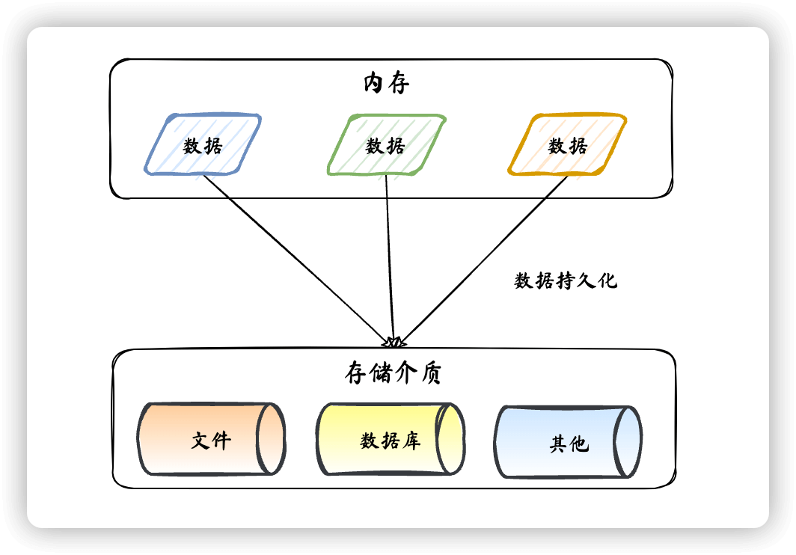
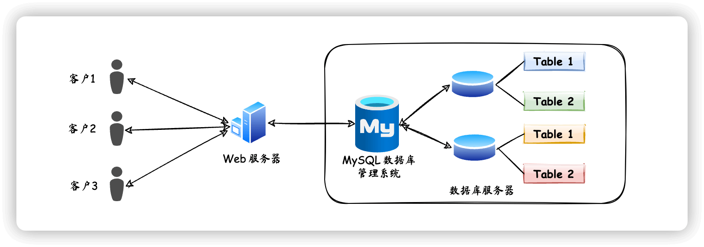
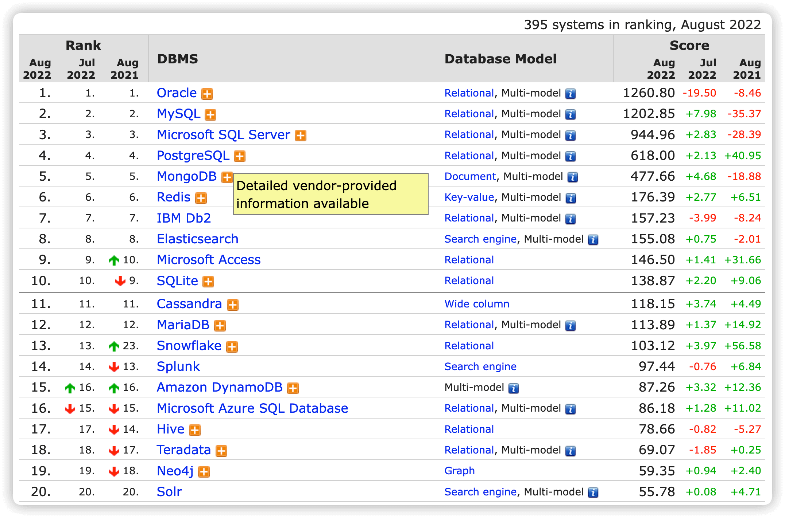
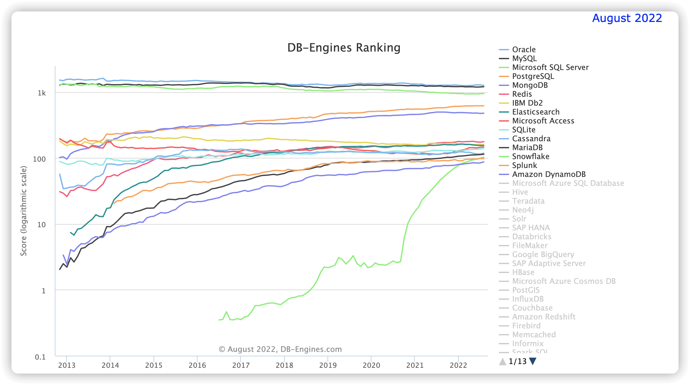

作者：村雨遥

博客：[studio](https://ez4jam1n.github.io/studio)

> 吾生也有涯，而知也无涯。

之前在 Java 基础部分的学习中，我们更多的是写一些和控制台进行交互的小程序，而这些小程序有个特点就是：一旦程序终止，那么程序中的数据就消失了。为了满足存储数据的需求，我们可以选择将程序中的数据保存到文本文件或者数据库中。而今天，我们就来看看数据库的简单知识，为后续基于数据库的开发打下基础。

## 为什么使用数据库

- **持久化**

数据保存后，掉电也可以在存储设备中进行使用，是一种将内存中数据保存到硬盘中加“固化”，这个过程大都通过各类数据库来完成。

- **持久化的作用**

将内存中的数据存储在关系型据库中，也可以存到其他存储介质，如磁盘文件、XML 数据文件、Json 数据文件中。

- **实例**

## 数据库与数据库管理系统

### 数据库相关概念

- **DB**

即数据库（Database），用于存储数据的“仓库”，本质上是一个文件系统，用于保存一系列有组织的数据。

- **DBMS**

即数据库管理系统（Database Management System），用于操纵和管理数据库的大型软件。主要用于数据库的创建、使用以及维护，通过统一的管理和控制，使得用户可以通过该系统来访问数据库中表内的数据。

- **SQL**

即结构化查询语言（Structured Query Language），用来专门和数据库进行通信的编程语言，定义了一套操作关系型数据库统一标准。

### 数据库与数据库管理系统的关系

一般而言，数据库管理系统可以管理多个数据库。我们一般会针对一个应用就创建一个对应的数据库，而为了保存应用中的数据，就会在数据库中创建多个表，用于保存对应实体用户的数据。

而数据库管理系统和数据库的关系就类似于视频播放器和视频的关系，其中数据库管理系统对应视频播放器，而数据库就类比于视频。通过数据库管理系统我们可以操作数据库，而通过视频播放器我们可以打开视频。

### 常见数据库管理系统排名

> https://db-engines.com/en/ranking#/
>
> https://db-engines.com/en/ranking_trend#/

以上两张图片是截止 2022 年 8 月份市场上各大数据库的市场占有率，可以看到 MySQL 无论是在现在，还是从历年的排名来看，排名都是较为靠前的。所以不缺乏使用 MySQL 的使用场景，也从侧面说明学好 MySQL 尤其重要。

## RDBMS 和 非 RDBMS

RDBMS，即关系型数据库，是当前 DBMS 的主流，其中以 Oracle、MySQL 和 SQL Server 最为典型。

### 关系型数据库（RDBMS）

- **实质**

关系型数据库是最古老的数据库类型，其模型是将复杂的数据结构归结为简单的二元关系，即二维表格形式，如下图形式。

关系型数据库以行（`row`）和列（`column`）的形式存储，两者共同组成表（`table`），而一个数据库（`database`）则通常包含着一系列的表（`table`）。

- **特点**

1.  使用表存储数据，格式统一，方便维护。
2.  使用 SQL 语言操作，标准统一，方便使用。

而表之间的数据记录存在着关系（`relationship`），对应着日常生活中各种实体之间的联系，这种联系也用**关系模型**来表示。而关系型数据库，就是建立在**关系模型**上的数据库。

- **优势**

1.  **支持复杂查询**：可以利用 SQL 语句方便地在一个表及多个表之间做非常复杂的数据查询工作。
2.  **支持事务**：使得对于安全性能较高的数据访问要求也得以实现。

### 非关系型数据库（非 RDBMS）

非关系型数据库，相对于传统的关系型数据库功能较少，基于键值对来进行数据的存储，无需经过 SQL 层的解析，而且减少关系型数据库中了不常用的功能，所以性能相比于关系型数据库更高。

相比于关系型数据库，常见的非关系型数据库有如下晋中类型：

- 键值型数据库

- 文档型数据库

- 搜索引擎数据库

- 列式数据库

- 图形数据库

1.  **键值型数据库**

键值型数据库通过 `key-value` 的形式来存储数据，其中 `key` 和 `value` 既可以是简单的对象，也能是复杂的对象。其中 `key` 作为唯一的标识符，所以是不允许重复的，因此优点也很明显，查找速度极快，但缺点是无法像关系型数据库一样使用条件来进行数据过滤。如果你不知道要查找的数据的对应的 `key`，那就必须去遍历整个数据库所有的键，消耗大量计算。

当前，Redis 可以说是最流行的键值型数据库，最经典的使用场景就是作为**内存缓存**。

2.  **文档型数据库**

文档型数据库可以用来获取文档，一般以 `XML`、`JSON` 等格式存放。在数据库中文档是最基本的处理信息单位，一个文档就相当于 MySQL 数据库中的一条记录，类似于键值型数据库中对应的 `value`。当前最流行的文档型数据库是 MongoDB，除此之外，还有 `CouchDB` 等。

3.  **搜索引擎数据库**

关系型数据库中为了提升检索效率，通常会采用索引，但是针对全文索引的效率却比较低。搜索引擎数据库是搜索引擎领域采用的数据存储形式，其核心原理是“倒排索引”。搜索引擎通过爬取大量的数据，然后以特定的格式进行存储，从而保证了检索时性能最优化。当前主流的搜索引擎数据库主要有：Elasticsearch、Solr、Splunk 等。

4.  **列式数据库**

之所以叫列式数据库，主要是针对行式存储的数据库而言。列式数据库通过将数据以列的形式存储到数据库中，从而大量降低了数据的 IO。基于该特点，列式数据库通常用在分布式文件系统中，功能也比较有限，当前最典型的列式数据库为 HBase 等。

5.  **图形数据库**

图形数据库用图这种数据结构存储了对象之间的关系，数据模式以节点和边（关系）来实现，用于高效解决复杂的关系问题，应用最多的是社交网络中人与人之间的关系。最常用的图形数据库有 Neo4j、InfoGrid 等。

利用图这种数据结构，将对象之间的关系进行存储。关系型数据库中，存储的一般都是关系比较明确的数据，对于关系较为复杂的数据，此时关系型数据库就有些力不从心了，此时，我们就可以采用图形数据库来进行存储。

## 关系型数据库设计原则

关系型数据库中，最典型的数据结构就是数据表，而这些表的组成都是格式化的。通过将数据到表中之后，再将多个表存放到库中。因此一个数据库里边通常包含了多个表，而每个表都有且仅有一个名字，用于标识自己。表中的多个特性则定义了数据如何存储在表中，就像 Java 中的类设计，一个表就类似于一个类，表中的每一列特征对应类中的各个属性，每一行则对应由类所生成的一个对象。

通常，一个数据库和编程语言 Java 中一个类的关系映射如下，也就是我们常说的 ORM（`Object Relational Mapping`） 思想的体现：

| 数据库   | Java           |
| -------- | -------------- |
| 一个表   | 一个类         |
| 一条记录 | 类中的一个对象 |
| 一个列   | 类中的一个属性 |

### 表、字段、记录

`E-R（Entity-Relationship）` 模型中，最核心的三个概念分别是：

- **实体集**
- **属性**
- **联系集**

一个实体集（`class`）对应着数据库中的一个表（`table`），一个实体（`instance`）则对应与数据库中的一行（`row`），也叫做一条记录（`record`）。一个属性（`attribute`）则对应于数据库表中的一列（`column`），也叫做一个字段（`field`）。

### 表之间的关联关系

既然一个表之间往往对应中 Java 中的一个类，那么不同表之间肯定也像类与类之间一样存在或多或少的联系，而最常见的则主要可以分为如下几种：

- **一对一关联**

- **一对多关联**

- **多对多关联**

1.  **一对一（one-to-one）**

这种关系非常简单，而且实际应用中并不多，因为我们可以将存在一对一关系的两个表合并成一个表，而不用创建多个表。

通常，针对存在一对一关系的表，建表时通常遵循以下原则：

- **外键唯一**：主表的主键和从表的外键形成主外键关系，要保证外键唯一。
- **外键是主键**：主表的主键和从表的主键共同形成主外键关系。

2.  **一对多（one-to-many）**

一对多关系建表原则：在从表（多方）中创建一个字段，字段作为外键指向主表（一方）的主键。

一个最常见的例子：一个学生存在着多门课程的成绩，因此学生表和成绩表之间的关系就是一对多的关系，我们可以在成绩表中创建一个字段（学号）作为外键，然后指向学生表的主键（学号），从而形成一对多的关系。

3.  **多对多**

除开上述两种关系之外，还有一种关系就是多对多关系，要表示多对多关系，此时两个表是满足不了的，必须创建第三个表，通常也称为**联接表**。通过将多对多关系划分为两个一对多关系，从而将这两个表的主键都插入到联接表中。

一个最常见的例子如下，学生和课程之间就存在多对多关系，一个学生可以选多门课，而一门课也可以被多个学生选择，因此必须创建一个联接表，也即选课表，来将两者的多对多的关系进行划分，然后将学生表中的主键（学号）和课程表中的主键（课程编号）插入到选课表中，用于表示学生和课程之间的多对多关系。

## MySQL 简介

### MySQL 版本

就像 IntelliJ IDEA 一样，MySQL 也主要提供了两个不同的版本，一个是社区版（`MySQL Community Server`），而另一个则是商业版（`MySQL Enterprise Edition`）。其中，社区版是免费的，大家都可以免费使用，但是 `MySQL` 官方是不提供任何技术支持的。商业版则是需要付费才能使用，和社区版的最大区别就在于官方会为它提供技术支持。同时，商业版还有免费的 30 天试用期，如果你只是想体验一把，那么大可在这个时间范围内去摸索对比下社区版和商业版在使用过程中的一些体验。

### 为什么选用 MySQL

主要归结于 MySQL 的如下特点：

- 基于 C 和 C++ 编写，使用多种编译器进行测试，保证了代码的可移植性。
- 支持多种操作系统，如 Windows、Linux、macOS。
- 为多种编程语言提供了 API，如 Java、Python、C++ 等。
- 支持多线程，充分利用 CPU 资源，支持多用户。
- 优化的 SQL 查询算法，有效提高查询速度。
- ……

### 如何选择 MySQL & Oracle

如果对于费用不是太敏感，而且对于性能和安全性有着更高的要求，那么推荐优先使用 Oracle。而由于 MySQL 体积小、速度快、成本低、源码开放等特点，许多互联网公司和中小型网站更喜欢选用 MySQL 作为网站数据库。