作者：村雨遥

博客：[JavaPark](https://cunyu1943.github.io/JavaPark)

> 吾生也有涯，而知也无涯。

之前了解了数据库的相关知识，然后又学习了如何安装 MySQL，接下来就来看看 SQL 常用语法，然后利用所学语法来操作我们的 MySQL 数据库实现增、删、改、查。

## SQL 通用语法

所谓通用语法，就是适用于所有关系型数据库的语法，而不是只针对某一个数据库。

常用的 SQL 通用语法主要有以下内容：

1.  SQL 语句可以以单行或多行书写，并且用分号 `;` 来表示一条语句的结束。

```sql
SELECT * FROM user;
```

```sql
SELECT *
FROM
user;
```

也就是说，以上两种方式书写的 SQL 语句其实最终实现的效果都是一样的。

2.  MySQL 中的 SQL 语句不区分大小写，但是为了将关键字和自定义变量分开，建议关键字使用大写。

```sql
SELECT * FROM user;
```

```sql
select * from user;
```

3.  SQL 中的两种种注释方式。

- **单行注释**

```bash
SQL语句 -- 注释内容
SQL语句 # 注释内容（MySQL 特有）
```

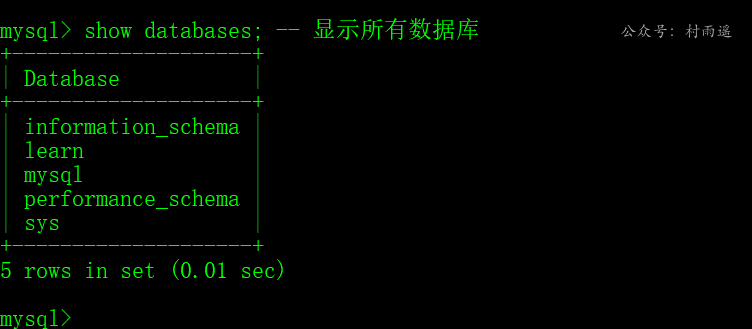

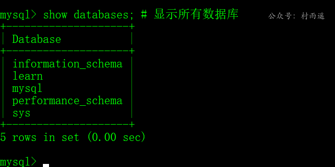

- **多行注释**

```bash
SQL语句 /* 注释内容 */
```

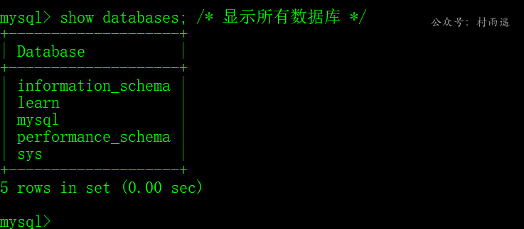

## SQL 分类

对于 SQL 语句，可以分为如下几类：

- **DDL**
- **DML**
- **DQL**
- **DCL**

| 分类    | 全程                       | 解释                                                   |
| ------- | -------------------------- | ------------------------------------------------------ |
| **DDL** | Data Definition Language   | 数据定义语言，用于定于数据库对象（数据库、表、字段等） |
| **DML** | Data Mainpulation Language | 数据操作语言，用于对数据库表中的数据进行增、删、改     |
| **DQL** | Data Query Language        | 数据查询语言，用于查询数据库中表的记录                 |
| **DCL** | Data Control Language      | 数据控制语言，用于创建数据库用户、控制数据库的访问权限 |

## DDL（Data Definition Language）

### 定义

用于**定义数据库对象**：数据库、表、列等，相关关键字：`CREATE`、`DROP`、`ALTER`……

### 数据库操作

#### 创建

- 通用

```sql
CREATE DATABASE [IF NOT EXISTS] 数据库名 [DEFAULT CHARSET 字符级] [COLLATE 排序规则];
```

- 创建数据库

```sql
CREATE DATABASE 数据库名;
```

- 创建数据库前先判断是否存在，不存在再创建

```sql
CREATE DATABASE IF NOT EXISTS 数据库名;
```

- 创建数据库的同时指定字符集

```sql
CREATE DATABASE 数据库名 CHARACTER SET 字符集名;
```


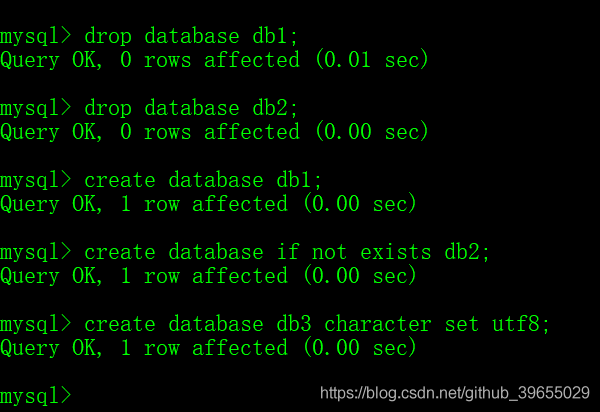

#### 查询

- 查询所有数据库名称；

```sql
SHOW DATABASES;
```

- 查询某一数据库的字符集和它的创建语句；

```sql
SHOW CREATE DATABASE 数据库名;
```

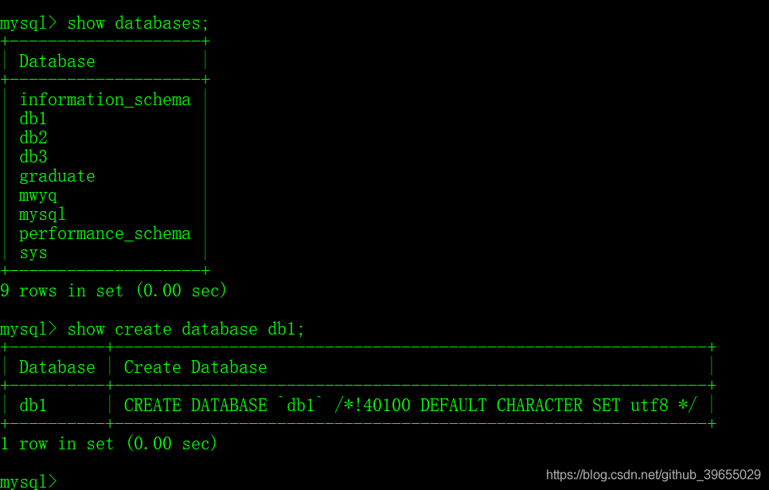

#### 更新

- 修改表名

```sql
RENAME TABEL 表名 TO 新表名;
```

- 修改数据库字符集

```sql
ALTER DATABASE 数据库名 CHARACTER SET 字符集名;
```


#### 删除

- 删除数据库

```sql
DROP DATABASE 数据库名;
```

- 判断数据库是否存在，存在再删除

```sql
DROP DATABASE IF EXISTS 数据库名;
```

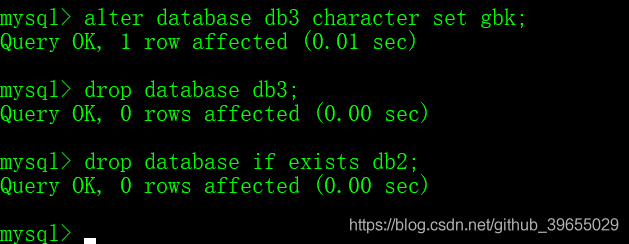

#### 使用

- 使用某一个数据库

```sql
USE 数据库名;
```

- 查询当前正在使用的数据库

```sql
SELECT DATABASE();
```

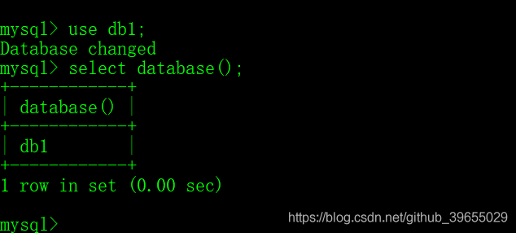

### 表操作

#### 创建

- 语法

```sql
CREATE TABLE 表名(
	列名1 数据类型 [COMMENT 列注释],
    列名2 数据类型 [COMMENT 列注释],
    ……
    列名n 数据类型 [COMMENT 列注释]
)[COMMENT 表注释];
```

- 常用数据类型

MySQL 中，数据类型有很多，但主要还是分为三大类：**数值类型**、**字符串类型**、**日期时间类型**。

1.  **数值类型**

| 类型        | 大小    | 有符号范围                                              | 无符号范围                                                  | 描述                 |
| ----------- | ------- | ------------------------------------------------------- | ----------------------------------------------------------- | -------------------- |
| TINYINT     | 1 Byte  | $(-128, 127)$                                           | $(0, 255)$                                                  | 小整数值             |
| SMALLINT    | 2 Bytes | $(-32768, 32767)$                                       | $(0, 65525)$                                                | 大整数值             |
| MEDIUMINT   | 3 Bytes | $(-8388608, 8388607)$                                   | $(0, 16777215)$                                             | 大整数值             |
| INT/INTEGER | 4 Bytes | $(-2147483648, 2147483647)$                             | $0, 4294967295$                                             | 大整数值             |
| BIGINT      | 8 Bytes | $(-2^{63}, 2^{63}-1)$                                   | $0, 2^{64}-1$                                               | 极大整数值           |
| FLOAT       | 4 Bytes | $(-3.402823466 E+38, 3.402823466351 E+38)$              | 0 和 $(1.175494351 E-38, 3.402823466 E+38)$                 | 单精度浮点数值       |
| DOUBLE      | 8 Bytes | $(-1.7976931348623157 E+308, 1.7976931348623157 E+308)$ | 0 和 $(2.2250738585072014 E-308, 1.7976931348623157 E+308)$ | 双精度浮点数值       |
| DECIMAL     |         | 依赖于精度（M）和标度（D）的值                          | 依赖于精度（M）和标度（D）的值                              | 小数值（精确定点数） |

2.  **字符串类型**


| 类型       | 大小                 | 描述                          |
| ---------- | -------------------- | ----------------------------- |
| CHAR       | 0 - 255 Bytes        | 定长字符串                    |
| VARCHAR    | 0 - 65535 Bytes      | 变长字符串                    |
| TINYBLOG   | 0 - 255 Bytes        | 不超过 255 个字符的二进制数据 |
| TINYTEXT   | 0 - 255 Bytes        | 短文本字符串                  |
| BLOB       | 0 - 65535 Bytes      | 二进制形式的长文本数据        |
| TEXT       | 0 - 65535 Bytes      | 长文本数据                    |
| MEDIUMBLOB | 0 - 16777215 Bytes   | 二进制形式的中等长度文本数据  |
| MEDIUMTEXT | 0 - 16777215 Bytes   | 中等长度文本数据              |
| LONGBLOB   | 0 - 4294967295 Bytes | 二进制形式的极大文本数据      |
| LONGTEXT   | 0 - 4294967295 Bytes | 极大文本数据                  |

3.  **日期时间类型**


| 类型      | 大小 | 范围                                      | 格式                | 描述                     |
| --------- | ---- | ----------------------------------------- | ------------------- | ------------------------ |
| DATE      | 3    | 1000-01-01 ~ 9999-12-31                   | YYYY-MM-DD          | 日期值                   |
| TIME      | 3    | -838:59:59 ~ 838:59:59                    | HH:MM:SS            | 时间值或持续时间         |
| YEAR      | 1    | 1901 ~ 2155                               | YYYY                | 年份值                   |
| DATETIME  | 8    | 1000-01-01 00:00:00 ~ 9999-12-31 23:59:59 | YYYY-MM-DD HH:MM:SS | 混合日期和时间值         |
| TIMESTAMP | 4    | 1970-01-01 00:00:01 ~ 2038-01-19 03:14:07 | YYYY-MM-DD HH:MM:SS | 混合日期和时间值，时间戳 |

- 表复制

```sql
CREATE TABLE 新表名 LIKE 被复制的表名;
```

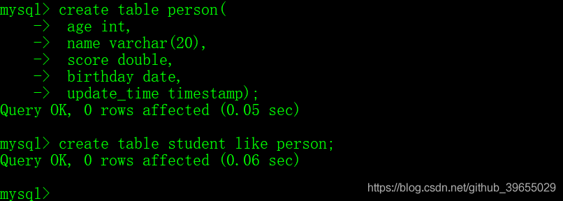

#### 查询

- 查询某个数据库中所有的表

```sql
SHOW TABLES;
```

- 查询表结构

```sql
DESC 表名;
```

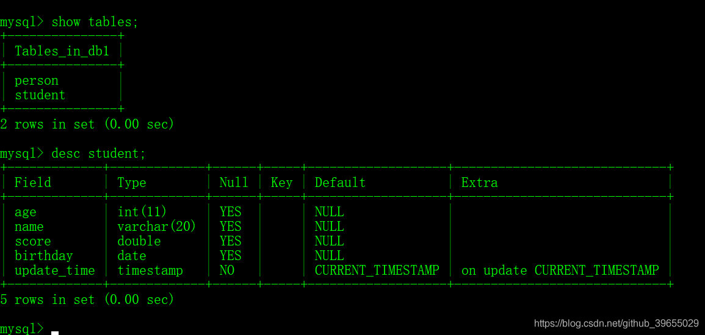

#### 更新

- 修改表名

```sql
ALTER TABLE 旧表名 RENAME TO 新表名;
```

- 修改表的字符集

```sql
ALTER TABLE 表名 CHARACTER SET 字符集名;
```

- 在表中添加一列

```sql
ALTER TABLE 表名 ADD 列名 数据类型;
```

- 修改列名称以及对应的数据类型

```sql
ALTER TABLE 表名 MODIFY 列名 新数据类型;
ALTER TABLE 表名 CHANGE 列名 新列名 新数据类型;
```

- 删除列

```sql
ALTER TABLE 表名 DROP 列名;
```

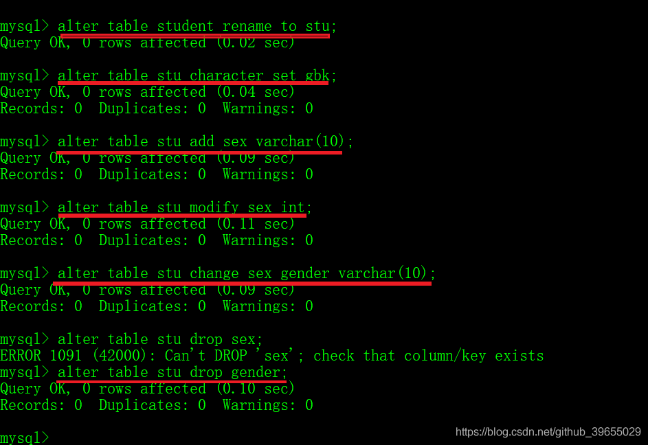

#### 删除

- 直接删除表

```sql
DROP TABLE 表名;
```

- 判断表是否存在，存在则删除

```sql
DROP TABLE IF EXISTS 表名;
```

- 删除指定表，并重新创建该表。

```sql
TRUNCATE TABLE 表名;
```

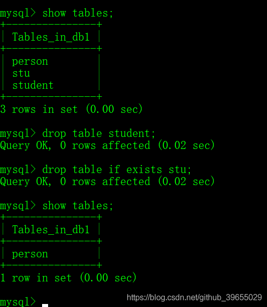


## DML（Data Manipulation Language）

### 定义

用于**对数据库中表的数据进行增删改**，相关关键字：`INSERT`、`UPDATE`、`DELETE`……

### 添加数据

1.  给指定字段添加数据

```sql
INSERT INTO 表名(列名1, 列名2, ……, 列名n) VALUES (值1, 值2, ……, 值n);
```

2.  给全部字段添加数据

```sql
INSERT INTO 表名 VALUES (值1, 值2, ……, 值n);
```

3.  批量添加数据

```sql
INSERT INTO 表名(列名1, 列名2, ……, 列名n) VALUES (值1, 值2, ……, 值n),(值1, 值2, ……, 值n),(值1, 值2, ……, 值n);
INSERT INTO 表名 VALUES (值1, 值2, ……, 值n),(值1, 值2, ……, 值n),(值1, 值2, ……, 值n);
```

### 删除数据

- 删除所有记录，有多少条记录就执行多少次删除操作

```sql
DELETE FROM 表名 [WHERE 条件];
```

- 删除所有数据，先删除表，然后创建一张结构一样的表，比 `DELETE` 效率更高

```sql
TRUNCATE TABLE 表名;
```

### 修改数据

```sql
UPDATE 表名 SET 列名1=值1, 列名2=值2, ……, 列名n=值n [WHERE 条件];
```


## DQL（Data Query Language）

### 定义

用于 **查询数据库中的数据**，相关关键字：`SELECT`、`HAVING`、`WHERE`……

### 语法

```sql
SELECT
	字段列表
FROM
	表名列表
WHERE
	条件列表
GROUP BY
	分组字段
HAVING
	分组后的条件
ORDER BY
	排序
LIMIT
	分页限定
OFFSET
	开始分页的起始位置
```

不过之得注意的是，以上只是 DQL 的编写顺序，当我们书写 DQL 语句时，需要按照以上顺序来书写。但在实际执行过程中，却不是按照书写顺序来执行的，而是按照以下顺序来执行的。

```sql
FROM
	表名列表
WHERE
	条件列表
GROUP BY
	分组后的条件
HAVING
	分组的条件列表
SELECT
	字段列表
ORDER BY
	排序字段列表
LIMIT
	分页参数
```

### 基础查询

- 多字段查询

```sql
SELECT 字段1,字段2,…… FROM 表名;
```

- 全部字段查询

```sql
SELECT * FROM 表名;
```

- 去重查询

```sql
SELECT DISTINCT 去重字段,字段1,字段2,…… FROM 表名;
```

- 起别名

```sql
# 两者其一
SELECT 字段名 AS 别名 FROM 表名;
SELECT 字段名 别名 FROM 表名;
```

### 条件查询

- 语法

```sql
SELECT 字段列表 FROM 表名 WHERE 条件列表;
```

- `WHERE` 后加条件

| 关键字                          | 意思                                                 | 例子                                 |
| ------------------------------- | ---------------------------------------------------- | ------------------------------------ |
| `>`、`<`、`>=`、`<=`、`=`、`!=` | 大于、小于、不小于、不大于、等于、不等于             | `col_name != 4`                      |
| `BETWEEN…AND…`                  | 介于两数之间，包含左右边界                           | `col_name BETWEEN 10 AND 100`        |
| `NOT BETWEEN…AND…`              | 不在两数之间                                         | `col_name NOT BETWEEN 10 AND 100`    |
| `IN(…)`                         | 在一个列表中                                         | `col_name IN (1, 4, 5)`              |
| `NOT IN(…)`                     | 不在一个列表                                         | `col_name NOT IN (1, 4, 5)`          |
| `LIKE`                          | 模糊查询，`_` 表示单个的任意字符，`%` 表示多个字符串 | `col_name like "ABC_"`               |
| `IS NULL`                       | 判断某一字段是否为 `NULL`                            | `col_name IS NULL`                   |
| `AND` 或 `&&`                   | 表示并行关系                                         | `col_name1 == 5 AND col_name2 == 10` |
| `OR` 或 `                       |                                                      | `                                    | 表示满足其中任一条件即可 | `col_name1 == 5 OR col_name2 == 10` |
| `NOT` 或 `!`                    | 表示否定                                             | `col_name IS NOT NULL`               |

### 聚合函数

通过将一列数据作为一个整体，进行纵向计算的函数，但是要注意的是，列中的所有 `null` 值都是不参与运算的。

| 函数    | 说明     |
| ------- | -------- |
| `count` | 统计数量 |
| `max`   | 最大值   |
| `min`   | 最小值   |
| `avg`   | 平均值   |
| `sum`   | 求和函数 |

### 分组查询

```sql
SELECT 字段列表 FROM 表名 [WHERE 条件] GROUP BY 分组字段名 [HAVING 分组后过滤条件];
```

这里需要注意 `HAVING` 和 `WHERE` 的区别，主 要有两点不一样，分别是：

1.  **执行时机**：`WHERE` 是在分组前进行过滤，不满足条件的就不参与分组，而 `HAVING` 则是对分组后的结果进行过滤。
2.  **判断条件**：`WHERE` 不能对聚合函数进行判断 ，但是 `HAVING` 可以。

### 分页查询

```sql
SELECT 字段列表 FROM 表名 LIMIT 起始索引, 查询记录数;
```

其中，起始索引一般是从 0 开始，起始索引 = （查询页码 - 1）\* 每页显示的记录数。

## DCL（Data Control Language）

### 定义

用于**定义数据库的访问权限和安全级别，以及用户创建**，相关关键字：`GRANT`、`REVOKE`……

### 用户管理

1.  查询用户

```sql
USE mysql;
SELECT * FROM user;
```

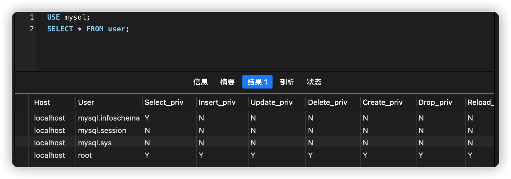

2.  创建用户

```sql
CREATE USER '用户名'@'主机名' IDENTIFIED BY '密码';
```

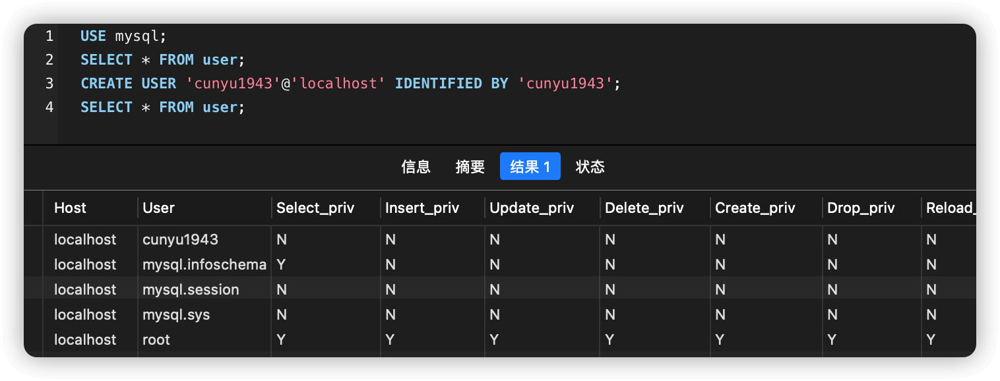

3.  修改用户密码

```sql
ALTER USER '用户名'@'主机名' IDENTIFIED WITH mysql_native_password BY '新密码';
```

4.  删除用户

```sql
DROP USER '用户名'@'主机名';
```


### 权限控制

| 权限                    | 说明               |
| ----------------------- | ------------------ |
| `ALL`、`ALL PRIVILEGES` | 所有权限           |
| `SELECT`                | 查询数据           |
| `INSERT`                | 插入数据           |
| `UPDATE`                | 修改数据           |
| `DELETE`                | 删除数据           |
| `ALTER`                 | 修改表             |
| `DROP`                  | 删除数据库/表/视图 |
| `CREATE`                | 创建数据库/表      |

1.  查询权限

```sql
SHOW GRANTS FOR '用户名'@'主机名';
```

2.  授权

```sql
GRANT 权限列表 ON 数据库名.表名 TO '用户名'@'主机名';
```

3.  撤销权限

```sql
REVOKE 权限列表 ON 数据库名.表名 FROM '用户名'@'主机名';
```
