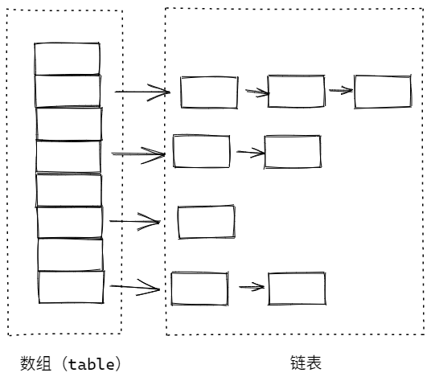
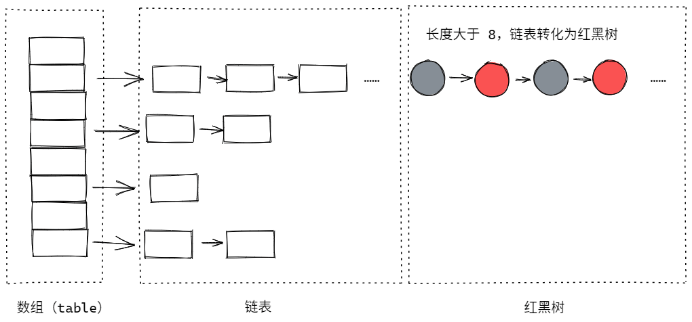
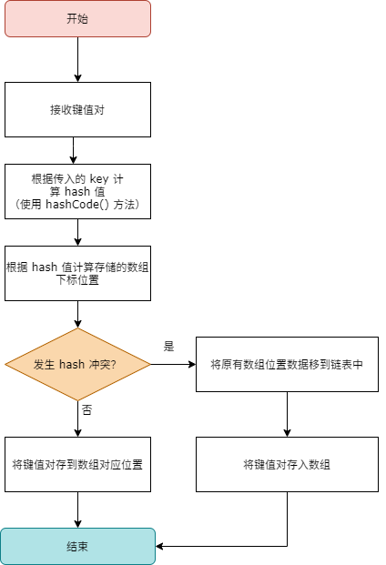
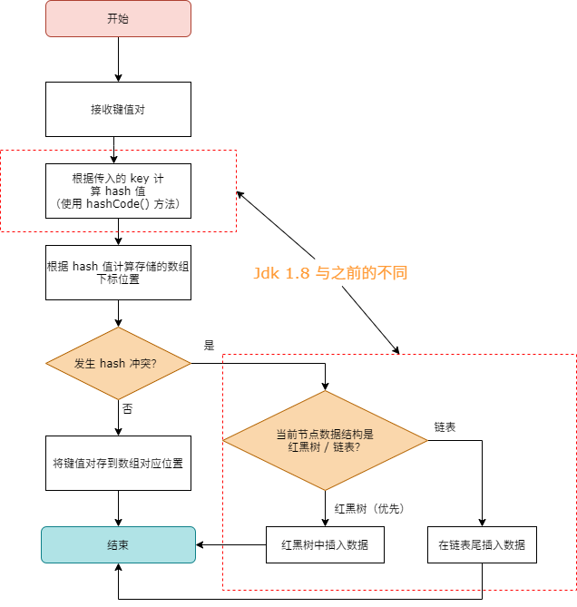
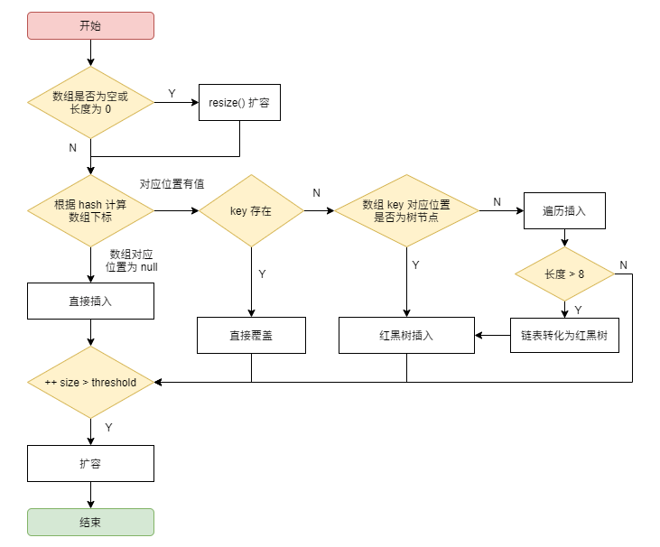

作者：村雨遥

博客：[studio](https://ez4jam1n.github.io/studio)

>   吾生也有涯，而知也无涯。


## HashMap 简介

推荐阅读：https://zhuanlan.zhihu.com/p/31610616

HashMap 是一个散列表，基于用于存储键值对（`key-value`） 的集合，每一个键值对也叫 `Entry`，分散存储在一个数组中，其中的每个元素的初始值均为 `null`。

HashMap 继承自 `AbstractMap`，实现了 `Map、Cloneable、java.io.Serializable` 接口。其实现不是同步的，意味着它不是线程安全的，其 `key、value` 均可为 `null`。另外，由于是键值对存储，所以其中的映射也是无序的。其定义如下：

```java
public class HashMap<K,V> extends AbstractMap<K,V>  implements Map<K,V>, Cloneable, Serializable
```

`HashMap` 基于 `Hash` 算法实现，通过 `put(key, value)` 存储，`get(key)` 获取。当传入 `key` 时，`HashMap` 会根据 `key.hashCode()` 计算 `hash` 值，然后根据 `hash` 值将 `value` 保存到数组。当 `hash` 值相同时，称为 `hash` 冲突，此时 `HashMap` 用链表和红黑树存储相同 `hash` 值的 `value`。当 `hash` 冲突个数较少时，使用链表，否则使用红黑树；

## 数据结构

### Jdk 1.7

JDK 1.8 之前，HashMap 底层是 **数组（主） + 链表（副）** 结合在一起使用，即 **链表散列**。通过 `key` 的 `hashCode` 经过 HashMap 的 `hash()` 方法（减少碰撞）后得到对应 `hash` 值，然后通过 `(n - 1) & hash` 判断当前元素存放位置（`n` 指数组大小），若当前位置存在元素，就判断该元素与要存入元素的 `hash` 值以及 `key` 是否相同，相同则直接覆盖，不同则通过 **拉链法** 解决冲突。

```java
static class Entry<K, V> implements Map.Entry<K, V>{
	final K key;
    V value;
    Entry<K, V> next;
    int hash;
    
    static int hash(int h) {
        // This function ensures that hashCodes that differ only by
        // constant multiples at each bit position have a bounded
        // number of collisions (approximately 8 at default load factor).

        h ^= (h >>> 20) ^ (h >>> 12);
        return h ^ (h >>> 7) ^ (h >>> 4);
	}
}
```

HashMap 中是一个数组，然后数组中的每个元素是一个单向链表。其中的每个实体是嵌套类 `Entry` 的实例，主要包括如下四个属性：

1.  **capacity**：当前数组容量，始终保持为 $2^n$，可以扩容，扩容后数组大小为当前的 2 倍；
2.  **loadFactor**：负载因子，**默认为 0.75**；
3.  **threshold**：扩容的阈值，等于 $capacity * laodFactor$；

-   **拉链法**

将数组和链表互相结合，即创建一个链表数组，数组中的每个元素实际上是一个链表头结点，一旦遇到哈希冲突，就将冲突的值加到链表中；



其中，**数组大小即为 HashMap 的容量，其中的每个元素是一个键值对（即链表的头节点）**。每个链表代表着哈希表的桶（bucket），链表长度即为桶的大小，其中的节点值对应一个键值对。所以一个 **HashMap 中的键值对数量 = 数组的键值对数量 + 所有单链表的键值对** ；

### Jdk 1.8

Jdk 1.8 之后，在解决哈希冲突时进行了改变，**当链表长度大于阈值（默认为 8）时，链表将转化为红黑树**。从而减少搜索的时间。**解决了发生哈希碰撞后，链表过长而导致的索引效率低的问题，提高了 `HashMap `的性能**。（红黑树增删改查较快，时间复杂度从 $O(n)$ 降到 $O(logn)$）。

-   红黑树作为存储结构，要解决 Hash 冲突的方案如下：

1.  无冲突时，存放在数组中；
2.  有冲突且链表长度 < 8 时：存放在单链表；
3.  有冲突且链表长度 > 8 时：存放在红黑树；

```java
// jdk 1.8 
static final int hash(Object key) {
    int h;
    // 第一步：h = key.hashCode() 取 hashCode 值
    // 第二步：h ^ (h >>> 16) 高位参与运算
    return (key == null) ? 0 : (h = key.hashCode()) ^ (h >>> 16);
}
```



-   **类的属性**

```java
public class HashMap<K,V> extends AbstractMap<K,V> implements Map<K,V>, Cloneable, Serializable {
    // 序列号
    private static final long serialVersionUID = 362498820763181265L;    
    // 默认的初始容量是 16
    static final int DEFAULT_INITIAL_CAPACITY = 1 << 4;   
    // 最大容量
    static final int MAXIMUM_CAPACITY = 1 << 30; 
    // 默认的填充因子 0.75
    static final float DEFAULT_LOAD_FACTOR = 0.75f;
    // 当桶(bucket)上的结点数大于这个值时会转成红黑树
    static final int TREEIFY_THRESHOLD = 8; 
    // 当桶(bucket)上的结点数小于这个值时树转链表
    static final int UNTREEIFY_THRESHOLD = 6;
    // 桶中结构转化为红黑树对应的table的最小大小
    static final int MIN_TREEIFY_CAPACITY = 64;
    // 存储元素的数组，总是2的幂次倍
    transient Node<k,v>[] table; 
    // 存放具体元素的集
    transient Set<map.entry<k,v>> entrySet;
    
    // 存放元素的个数，注意这个不等于数组的长度。
    transient int size;
    // 每次扩容和更改map结构的计数器
    transient int modCount;   
    // 临界值 当实际大小(容量*填充因子)超过临界值时，会进行扩容
    int threshold;
    // 加载因子
    final float loadFactor;
}

```

哈希桶数组的初始长度 `length` 为 16，负载因子 `loadFactor` 默认值为 $0.75$，临界值 `threshold` 是 `HashMap` 所能容纳的最大数据量的 `Node` （键值对）的个数，`threshold = length * loadFactor`。也就是说，数组定义好长度后，负载因子越大，所能容纳的键值对个数越多。

## 存储过程

### Jdk 1.7

Jdk 1.7 中，存储流程如下图所示，HashMap 中的数组元素和链表节点通过 `Entry` 类实现。即 HashMap 的本质其实是一个存储 `Entry` 类对象的数组和多个单链表组成。一个 `Entry` 对象就是一个键值对。



### Jdk 1.8

Jdk 1.8 中，数据存储过程如下图所示。此时 HashMap 中的数组元素和链表节点采用 `Node` 类实现。



### JDK 1.7 vs JDK 1.8

JDK 1.8 主要解决和优化的问题：

1.  `resize` 扩容优化；
2.  引入红黑树，目的是避免单条链表过长而影响查询效率；
3.  解决多线程死循环问题，但仍非线程安全，多线程时可能会导致数据丢失；

| 不同的                   | JDK 1.7                                         | JDK 1.8                                                                                                   |
| ------------------------ | ----------------------------------------------- | --------------------------------------------------------------------------------------------------------- |
| 存储结构                 | 数组 + 链表                                     | 数组 + 链表 + 红黑树                                                                                      |
| 初始化方式               | `inflateTable()`                                | `resize()`                                                                                                |
| `hash` 值计算方式        | 扰动处理 = 9 次扰动 = 4 次位运算 + 5 次异或运算 | 扰动处理 = 2 次扰动 = 1 次位运算 + 1 次异或运算                                                           |
| 存放数据的规则           | 1、无冲突时存数组；<br />2、发生冲突时放链表    | 1、无冲突时存数组；<br />2、冲突 & 链表长度 < 8：存放单链表<br />3、冲突 & 链表长度 > 8：树华并存放红黑树 |
| 扩容后存储位置的计算方式 | `hashCode` -> 扰动函数 -> (h & length - 1)      | 扩容后位置 = 原位置 or 原位置 + 旧容量                                                                    |


##  源码分析

###  构造方法

```java
// 默认构造函数。
public HashMap() {
    this.loadFactor = DEFAULT_LOAD_FACTOR; // all   other fields defaulted
}

// 包含另一个“Map”的构造函数
public HashMap(Map<? extends K, ? extends V> m) {
    this.loadFactor = DEFAULT_LOAD_FACTOR;
    putMapEntries(m, false);
}

// 指定“容量大小”的构造函数
public HashMap(int initialCapacity) {
    this(initialCapacity, DEFAULT_LOAD_FACTOR);
}

// 指定“容量大小”和“加载因子”的构造函数
public HashMap(int initialCapacity, float loadFactor) {
    if (initialCapacity < 0)
        throw new IllegalArgumentException("Illegal initial capacity: " + initialCapacity);
    if (initialCapacity > MAXIMUM_CAPACITY)
        initialCapacity = MAXIMUM_CAPACITY;
    if (loadFactor <= 0 || Float.isNaN(loadFactor))
        throw new IllegalArgumentException("Illegal load factor: " + loadFactor);
    this.loadFactor = loadFactor;
    this.threshold = tableSizeFor(initialCapacity);
}

```

### get 方法

```java
public V get(Object key) {
    Node<K,V> e;
    return (e = getNode(hash(key), key)) == null ? null : e.value;
}

final Node<K,V> getNode(int hash, Object key) {
    Node<K,V>[] tab; Node<K,V> first, e; int n; K k;
    if ((tab = table) != null && (n = tab.length) > 0 &&
        (first = tab[(n - 1) & hash]) != null) {
        // 数组元素相等
        if (first.hash == hash && // always check first node
            ((k = first.key) == key || (key != null && key.equals(k))))
            return first;
        // 桶中不止一个节点
        if ((e = first.next) != null) {
            // 在树中get
            if (first instanceof TreeNode)
                return ((TreeNode<K,V>)first).getTreeNode(hash, key);
            // 在链表中get
            do {
                if (e.hash == hash &&
                    ((k = e.key) == key || (key != null && key.equals(k))))
                    return e;
            } while ((e = e.next) != null);
        }
    }
    return null;
}
```

###  put 方法

1.  Jdk 1.7

Jdk 1.7 中，如果 `hash` 对应数组位置没有元素，就直接插入。如果对应位置有元素，则遍历该元素为头节点的链表，然后依次和插入的 `key` 进行比较，如果 `key` 相同就直接覆盖，不同则采用头插法插入元素。

```java
public V put(K key, V value){
    if (table == EMPTY_TABLE) { 
        inflateTable(threshold); 
    }  
    if (key == null)
        return putForNullKey(value);
    int hash = hash(key);
    int i = indexFor(hash, table.length);
    for (Entry<K,V> e = table[i]; e != null; e = e.next) { // 先遍历
        Object k;
        if (e.hash == hash && ((k = e.key) == key || key.equals(k))) {
            V oldValue = e.value;
            e.value = value;
            e.recordAccess(this);
            return oldValue; 
        }
    }

    modCount++;
    addEntry(hash, key, value, i);  // 再插入
    return null;
}
```

2.  Jdk 1.8

HashMap  仅提供了 `put` 用于添加元素， 实际上调用的是 `putVal` 方法，但是 `putVal` 并不直接提供给用户。如果 `hash` 对应数组位置无元素，则直接插入。如果对应位置有元素，则将该元素和即将插入的 `key` 进行比较，若 `key` 相同则直接覆盖，不同就判断是否是一个树节点，是就调用 `e = ((TreeNode<K,V>)p).putTreeVal(this, tab, hash, key, value)` 将元素添加到红黑树；如果不是树节点，就遍历链表插入链表尾部。



```java
public V put(K key, V value) {
    return putVal(hash(key), key, value, false, true);
}

final V putVal(int hash, K key, V value, boolean onlyIfAbsent,
               boolean evict) {
    Node<K,V>[] tab; Node<K,V> p; int n, i;
    // 1. table未初始化或者长度为0，进行扩容
    if ((tab = table) == null || (n = tab.length) == 0)
        n = (tab = resize()).length;
    // 2. (n - 1) & hash 确定元素存放在哪个桶中，桶为空，新生成结点放入桶中(此时，这个结点是放在数组中)
    if ((p = tab[i = (n - 1) & hash]) == null)
        tab[i] = newNode(hash, key, value, null);
    // 桶中已经存在元素
    else {
        Node<K,V> e; K k;
        // 3. 比较桶中第一个元素(数组中的结点)的hash值相等，key相等，即 key 存在，则直接覆盖 value
        if (p.hash == hash &&
            ((k = p.key) == key || (key != null && key.equals(k))))
            // 将第一个元素赋值给e，用e来记录
            e = p;
        // 4. hash值不相等，即key不相等；判断该链为红黑树结点
        else if (p instanceof TreeNode)
            // 放入树中
            e = ((TreeNode<K,V>)p).putTreeVal(this, tab, hash, key, value);
        // 5. 判断该链为链表结点
        else {
            // 在链表最末插入结点
            for (int binCount = 0; ; ++binCount) {
                // 到达链表的尾部
                if ((e = p.next) == null) {
                    // 在尾部插入新结点
                    p.next = newNode(hash, key, value, null);
                    // 结点数量达到阈值 8，转化为红黑树
                    if (binCount >= TREEIFY_THRESHOLD - 1) // -1 for 1st
                        treeifyBin(tab, hash);
                    // 跳出循环
                    break;
                }
                // 判断链表中结点的key值与插入的元素的key值是否相等
                if (e.hash == hash &&
                    ((k = e.key) == key || (key != null && key.equals(k))))
                    // 相等，跳出循环
                    break;
                // 用于遍历桶中的链表，与前面的e = p.next组合，可以遍历链表
                p = e;
            }
        }
        // 表示在桶中找到key值、hash值与插入元素相等的结点
        if (e != null) { 
            // 记录e的value
            V oldValue = e.value;
            // onlyIfAbsent为false或者旧值为null
            if (!onlyIfAbsent || oldValue == null)
                //用新值替换旧值
                e.value = value;
            // 访问后回调
            afterNodeAccess(e);
            // 返回旧值
            return oldValue;
        }
    }
    // 结构性修改
    ++modCount;
    // 6. 实际大小大于阈值则扩容
    if (++size > threshold)
        resize();
    // 插入后回调
    afterNodeInsertion(evict);
    return null;
} 
```

###  resize 方法

主要用于扩容，伴随着异常重新分配 `hash`，而且会遍历 `hash` 表中素有元素，比较耗时。

```java
final Node<K,V>[] resize() {
    Node<K,V>[] oldTab = table;
    int oldCap = (oldTab == null) ? 0 : oldTab.length;
    int oldThr = threshold;
    int newCap, newThr = 0;
    if (oldCap > 0) {
        // 超过最大值就不再扩充了，让其随意碰撞
        if (oldCap >= MAXIMUM_CAPACITY) {
            threshold = Integer.MAX_VALUE;
            return oldTab;
        }
        // 没超过最大值，就扩容为原来的2倍
        else if ((newCap = oldCap << 1) < MAXIMUM_CAPACITY && oldCap >= DEFAULT_INITIAL_CAPACITY)
            newThr = oldThr << 1; // double threshold
    }
    else if (oldThr > 0) // initial capacity was placed in threshold
        newCap = oldThr;
    else { 
        // signifies using defaults
        newCap = DEFAULT_INITIAL_CAPACITY;
        newThr = (int)(DEFAULT_LOAD_FACTOR * DEFAULT_INITIAL_CAPACITY);
    }
    // 计算新的 resize 上限
    if (newThr == 0) {
        float ft = (float)newCap * loadFactor;
        newThr = (newCap < MAXIMUM_CAPACITY && ft < (float)MAXIMUM_CAPACITY ? (int)ft : Integer.MAX_VALUE);
    }
    threshold = newThr;
    @SuppressWarnings({"rawtypes","unchecked"})
    Node<K,V>[] newTab = (Node<K,V>[])new Node[newCap];
    table = newTab;
    if (oldTab != null) {
        // 把每个 bucket 都移动到新的 buckets 中
        for (int j = 0; j < oldCap; ++j) {
            Node<K,V> e;
            if ((e = oldTab[j]) != null) {
                oldTab[j] = null;
                if (e.next == null)
                    newTab[e.hash & (newCap - 1)] = e;
                else if (e instanceof TreeNode)
                    ((TreeNode<K,V>)e).split(this, newTab, j, oldCap);
                else { 
                    // 连边优化重复 hash 的代码块
                    Node<K,V> loHead = null, loTail = null;
                    Node<K,V> hiHead = null, hiTail = null;
                    Node<K,V> next;
                    do {
                        next = e.next;
                        // 原索引
                        if ((e.hash & oldCap) == 0) {
                            if (loTail == null)
                                loHead = e;
                            else
                                loTail.next = e;
                            loTail = e;
                        }
                        // 原索引+oldCap
                        else {
                            if (hiTail == null)
                                hiHead = e;
                            else
                                hiTail.next = e;
                            hiTail = e;
                        }
                    } while ((e = next) != null);
                    // 原索引放到bucket里
                    if (loTail != null) {
                        loTail.next = null;
                        newTab[j] = loHead;
                    }
                    // 原索引+oldCap放到bucket里
                    if (hiTail != null) {
                        hiTail.next = null;
                        newTab[j + oldCap] = hiHead;
                    }
                }
            }
        }
    }
    return newTab;
}
```

## 常用方法

```java
import java.util.Collection;
import java.util.HashMap;
import java.util.Set;

public class HashMapDemo {

    public static void main(String[] args) {
        HashMap<String, String> map = new HashMap<String, String>();
        // key 必须唯一不能重复，但 value 可以重复
        map.put("cunyu", "村雨遥");
        map.put("si", "李四");
        map.put("wu", "王五");
        map.put("zhou", "周六1");
        map.put("zhou", "周六2");// 周六1被覆盖
        map.put("lao", "老王");

        System.out.println("-------直接输出hashmap:-------");
        System.out.println(map);

        /**
             * 遍历HashMap
             */

        // 1.获取Map中的所有键
        System.out.println("-------foreach获取Map中所有的键:------");
        Set<String> keys = map.keySet();
        for (String key : keys) {
            System.out.print(key + "  ");
        }
        System.out.println();

        // 2.获取Map中所有值
        System.out.println("-------foreach获取Map中所有的值:------");
        Collection<String> values = map.values();
        for (String value : values) {
            System.out.print(value + "  ");
        }
        System.out.println();

        // 3.得到 key 的值的同时得到对应的值 value
        System.out.println("-------得到key的值的同时得到key所对应的值:-------");
        Set<String> keys2 = map.keySet();
        for (String key : keys2) {
            System.out.print(key + "：" + map.get(key) + "   ");

        }


        // 同时获取 key + value
        Set<java.util.Map.Entry<String, String>> entrys = map.entrySet();
        for (java.util.Map.Entry<String, String> entry : entrys) {
            System.out.println(entry.getKey() + "--" + entry.getValue());
        }

        /**
             * HashMap其他常用方法
             */
        // 规模
        System.out.println("after map.size()：" + map.size());
        // 是否为空
        System.out.println("after map.isEmpty()：" + map.isEmpty());
        // 移除元素
        System.out.println(map.remove("san"));
        System.out.println("after map.remove()：" + map);
        // 查看元素
        System.out.println("after map.get(si)：" + map.get("si"));
        // 是否包含某 key
        System.out.println("after map.containsKey(si)：" + map.containsKey("si"));
        // 是否包含某 value
        System.out.println("after containsValue(李四)：" + map.containsValue("李四"));
        // 替换
        System.out.println(map.replace("si", "李四2"));
        System.out.println("after map.replace(si, 李四2):" + map);
    }

}
```

6.  HashMap 操作注意事项及优化

1.  扩容消耗性能较大，所以在使用 `HashMap` 时，最好估定一个大致的初始化值，避免频繁扩容；
2.  负载因子是可以修改的，默认为 $0.75$；
3.  `HashMap` 是线程不安全的，所以不要在并发环境中同时操作 `HashMap`，并发环境下推荐使用 `ConcurrentHashMap`；

## 参考资料

1.  [Java：手把手带你源码分析 HashMap 1.7](https://blog.csdn.net/carson_ho/article/details/79373026)

2.  [Java源码分析：关于 HashMap 1.8 的重大更新](https://blog.csdn.net/carson_ho/article/details/79373134)