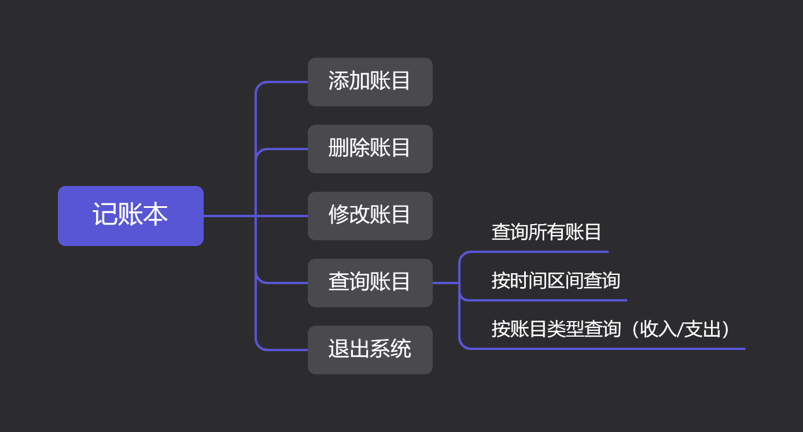
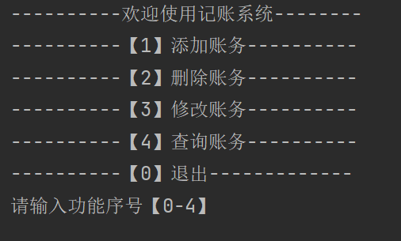
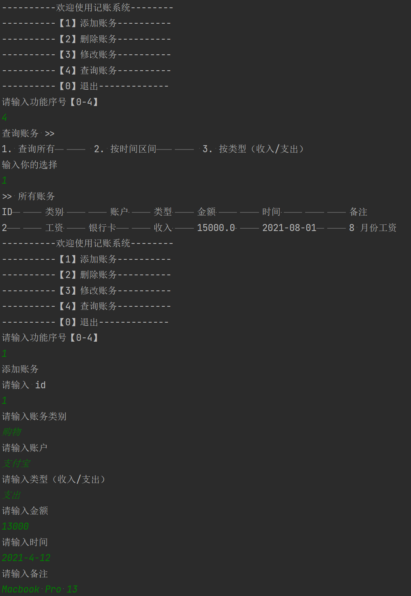
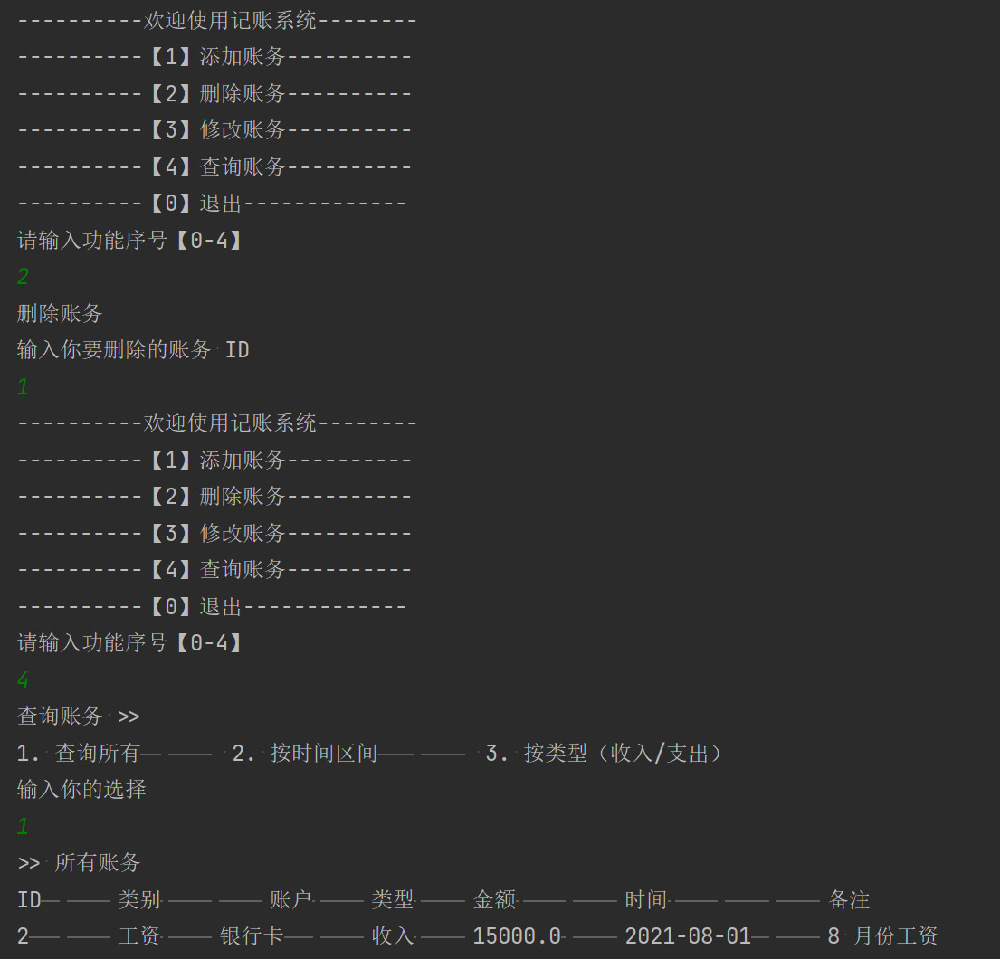
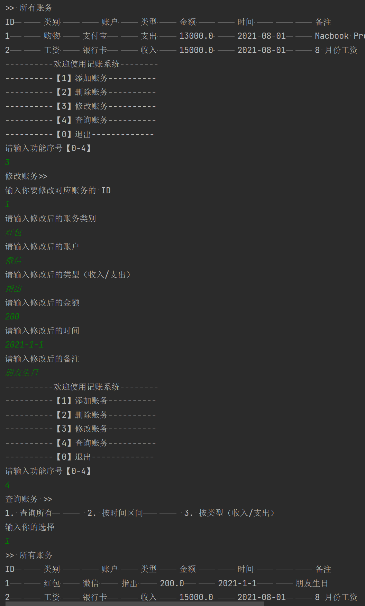
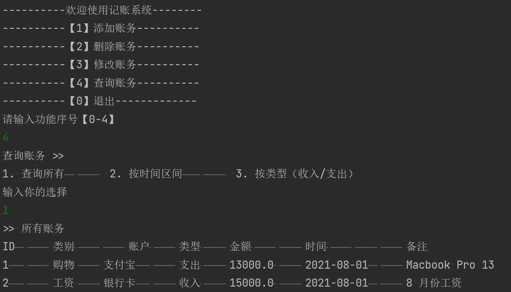
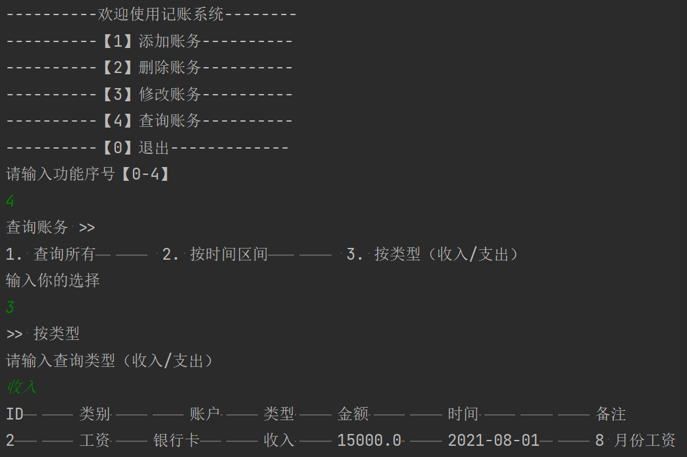
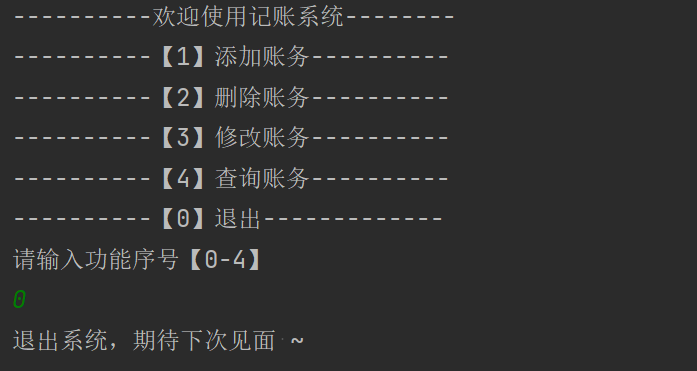
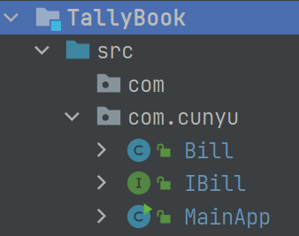

作者：benjamin

博客：[studio](https://benjam1n.eu.org)

> 吾生也有涯，而知也无涯。

---

## 前言

之前已经写过关于 [学生成绩管理系统](20220301-score-management.md) 以及 [点菜系统](20220302-order-system.md) 的文章，大家如果感兴趣，可以点击各自的传送门去看看呀！

接下来开始我们今天的正题，我们日常生活中，想必有很多人都有记账的习惯，那今天，我们就来看看，如何设计并实现一个记账本。

## 需求分析

打开我们手机里的记账本，可以发现主要提供如下几个功能：

1.  **添加账目**
2.  **删除账目**

3.  **修改账目**
4.  **查询账目**

- - 查询所有账目
  - 按时间区间查询

- - 按账目类型查询

1.  **退出记账本**



## 功能预览及代码实现

### 主菜单

主菜单中，主要用于打印提示我们进行选择，然后根据我们的输入再进入不同的子功能模块中。

- 预览



- 代码实现

代码实现很简单，只需要打印出提示信息即可，之后后续输入以及进入不同子功能模块，我们可以使用 `switch` 来进行选择。

```java
package com.cunyu;

import java.util.ArrayList;
import java.util.Arrays;
import java.util.List;
import java.util.Scanner;

/**
 * Created with IntelliJ IDEA.
 *
 * @author : 村雨
 * @version : 1.0
 * @project : Java 实战
 * @package : com.cunyu
 * @className : MainApp
 * @createTime : 2021/8/1 7:22
 * @email : 747731461@qq.com
 * @公众号 : benjamin
 * @website : https://ez4jam1n.github.io
 * @description :
 */
public class MainApp {

    public static void main(String[] args) {

        boolean flag = true;
        while (flag) {
            System.out.println("----------欢迎使用记账系统--------");
            System.out.println("----------【1】添加账务----------");
            System.out.println("----------【2】删除账务----------");
            System.out.println("----------【3】修改账务----------");
            System.out.println("----------【4】查询账务----------");
            System.out.println("----------【0】退出-------------");
            System.out.println("请输入功能序号【0-4】");
        }
        System.out.println("退出系统，期待下次见面 ~");
    }
}
```

### 添加账目

当我们需要添加一笔新的账目时，此时就可以进入 **添加账目** 子模块，这里的功能主要是根据我们自己输入的 ID、类别、账户、类型、金额、时间以及备注将其添加到我们的总账目列表中进行汇总。

- 预览



- 代码实现

要实现添加功能也很简单，根据我们的输入，我们利用账目类的构造函数创建一个对象，然后将其加入总账目列表当中就可以了。

```java
public void add(List<Bill> billList, int id, String category, String account, String type, double amount, String time, String desc) {
    //创建一个账单对象，然后将其加入列表
    Bill bill = new Bill(id, category, account, type, amount, time, desc);
    billList.add(bill);
}
```

### 删除账目

假如我们的账目要公开给别人看，而自己有的账目又不想让别人看到，咋办呢？很简单！我们只需要将这笔账目干掉即可！这里我们只要输入我们所要删除的账单 ID，然后将其从总账目列表中删除即可。

- 预览



- 代码实现

要删除我们的账目，只需要根据我们输入的账单 id，找到对应 id 的账目，然后将其删除即可，这里之所以没有使用 `remove(index)` 的方式，是因为我们的 id 是自己输入的，这其实是不规则的，如果我们使用 `remove(index)` 的方式，就有可能导致越界的问题。

```java
public void del(List<Bill> billList, int id) {
    //找到对应 id 的账单，并将其删除
    for (Bill bill : billList) {
        if (bill.getId() == id) {
            billList.remove(bill);
        }
    }
}
```

### 修改账目

我们偷偷拿了私房钱买了猛男必备显卡（RTX 3090）想趁空了打打游戏，遇到老婆查账时，这时候可不能慌，我们只需要把账单偷梁换柱，改换成其他东西就可以，而且此事神不知鬼不觉，美滋滋呀！

- 预览



- 代码实现

利用代码实现也很简单，找到对应 ID 的账单，然后重新输入账单各个细节进行修改即可！

```java
public void modify(List<Bill> billList) {
    Scanner scanner = new Scanner(System.in);
    System.out.println("输入你要修改对应账务的 ID");
    int id = scanner.nextInt();

    System.out.println("请输入修改后的账务类别");
    String category = scanner.next();

    System.out.println("请输入修改后的账户");
    String account = scanner.next();

    System.out.println("请输入修改后的类型（收入/支出）");
    String type = scanner.next();

    System.out.println("请输入修改后的金额");
    double amount = scanner.nextDouble();

    System.out.println("请输入修改后的时间");
    String time = scanner.next();

    System.out.println("请输入修改后的备注");
    String description = scanner.next();
    //找到对应 id 的账单，然后修改对应信息
    for (Bill bill : billList) {

        if (bill.getId() == id) {

            bill.setCategory(category);
            bill.setAmount(amount);
            bill.setAccount(account);
            bill.setTime(time);
            bill.setType(type);
            bill.setDesc(description);
        }
    }

}
```

### 查询账目

查询账目这里，我们又分为 3 个不同的功能，既可以查看所有账单，也可以根据我们所输入的时间区间进行筛选，最后，还能够根据我们的输入查询出收入和支出的详细情况。

#### 查询所有账目

- 预览



- 代码实现

查询所有账单很简单，只需要遍历我们总账单列表即可。

```java
public void queryAll(List<Bill> billList) {
    System.out.println("ID\t\t类别\t\t\t账户\t\t类型\t\t金额\t\t\t时间\t\t\t\t备注");
    for (Bill bill : billList) {
        System.out.println(bill.getId() + "\t\t" + bill.getCategory() + "\t\t" + bill.getAccount() + "\t\t" + bill.getType() + "\t\t" + bill.getAmount() + "\t\t" + bill.getTime() + "\t\t" + bill.getDesc());
    }
}
```

#### 按时间区间查询

- 预览


- 代码实现

按照时间跨度来查询稍微要麻烦一些，这里要处理两个输入，一个是开始时间，一个是结束时间，我们需要将账单的时间和这两个时间进行比较，筛选出介于这两者之间的账单。所以这里要涉及到 `Date` 类，然后就是如何从总账单列表中过滤出满足时间跨度的账单。

```java
public void queryByTime(List<Bill> billList, String startTime, String endTime) {
    // 时间格式化
    SimpleDateFormat simpleDateFormat = new SimpleDateFormat("yyyy-MM-dd");
    List<Bill> bills = billList.stream().filter(bill -> {
        String tmpTime = bill.getTime();
        try {
            // 将输入的时间字符串转换为格式化的 Date 类型
            Date tmpDate = simpleDateFormat.parse(tmpTime);
            Date startDate = simpleDateFormat.parse(startTime);
            Date endDate = simpleDateFormat.parse(endTime);
            // 将介于开始时间和结束时间的账单进行过滤
            if (tmpDate.before(endDate) && tmpDate.after(startDate)) {
                return true;
            }
        } catch (ParseException parseException) {
            parseException.printStackTrace();
        }
        return false;
        //    将其转换为列表
    }).collect(Collectors.toList());

    queryAll(bills);
}
```

#### 按类型查询

- 预览



- 代码实现

这里按类型查询其实就是在查询所有账单的基础上加上一个限制条件，只要其类型等于我们的输入即可，这里我写了两种筛选的方法。一种是直接使用 `if` 语句进行过滤，而另一种则是同按时间跨度一样使用集合的 `Stream` 流来进行过滤。

```java
public void queryByType(List<Bill> billList, String type) {
    //1. 第一种方式，利用条件判断
    //for (Bill bill : billList) {
    //    if (bill.getType().equals(type)) {
    //        System.out.println(bill.getId() + "\t\t" + bill.getCategory() + "\t\t" + bill.getAccount() + "\t\t" + bill.getType() + "\t\t" + bill.getAmount() + "\t\t" + bill.getTime() + "\t\t" + bill.getDesc());
    //    }
    //}

    //2. 第二种方式，利用集合 Stream 流
    List<Bill> bills = billList.stream().filter(bill -> {
        String tmpType = bill.getType();
        return tmpType.equals(type);
    }).collect(Collectors.toList());
    queryAll(bills);
}
```

### 退出系统

- 预览



- 代码实现

在主菜单中，我们已经设置了一个标志位 `flag`，当 `flag` 为 `true` 时，我们每完成一项功能则循环打印主菜单在控制台中，而如果我们想要退出系统，只需要将标志位 `flag` 设置为 `false` 即可，此时不满足 `while` 循环的条件，所以跳出循环，因此退出系统的关键在于标志位状态的转换。

```java
case "0":
    flag = false;
    break;
```

## 整体程序

将各个子模块功能实现之后，剩下的就是整合工作了，最后得到我们最后的总体程序结构如下，主要代码均位于 `com.cunyu` 包下，然后分别是：

- 实体类 `Bill`
- 接口类 `IBill`

- 主程序 `MainApp`



## 总结

好了，以上就是我们简单的记账本的实现了。实现的功能比较简陋，程序的健壮性也不够强，还有很大的优化空间。大家如果感兴趣或者有优化的地方，欢迎到本设计的 Github 仓库地址：https://github.com/ez4jam1n/java-in-actions 提交 issue。当然了，如果你只是需要用来简单的做个示例，也可以自取。

最后，如果本文对大家有用的话，希望给我一个 ⭐ **star**，满足一下我的虚荣心呀 ~ 🙊🙊🙊
