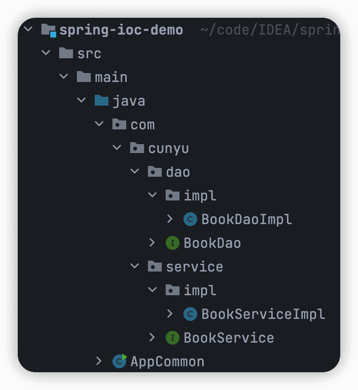

作者：村雨遥

博客：[studio](https://ez4jam1n.github.io/studio)

> 吾生也有涯，而知也无涯。

---

## IoC

IoC（`Inversion of Control`），中文名又叫做控制反转。

针对当前书写代码时耦合度偏高的现状，大牛们提出了对应的解决方案。那就是在使用对象时，不要再通过主动使用 `new` 来创建对象，而是转变为由外部来提供对象。而这种将对象的创建控制权从程序转移到**外部**的思想就叫做**控制反转**。

总结来说，IoC 就是指在使用对象时由主动 `new` 创建对象的方式转换为由外部提供，这个过程中对象的创建控制权由程序转移到了外部，这个思想就叫做控制反转。而 Spring 实现了 IoC 思想，它提供了一个容器用来充当 IoC 思想中的外部，而我们将这个容器称为 IoC 容器。

IoC 容器专门负责对象创建、初始化等一系列工作，而这些由 IoC 容器所管理的对象我们统称为 `Bean`。

## DI

DI（`Dependency Injection`），中文名又叫做依赖注入。

IoC 容器虽然负责了创建和初始化对象等一系列工作，但实际上不同的对象之间或多或少存在着依赖关系，这个问题 IoC 是解决不了的，因此才有了 DI 的提出。依赖注入实现了容器中 Bean 与 Bean 之间依赖关系的建立。

## 入门案例

接下来我们来看看 IoC 的一个入门实例。

首先，我们创建一个 Maven 项目，如果不太熟悉如何创建，可以参考我之前的一篇教程 -> [使用 IDEA 创建 Maven 项目](https://ez4jam1n.github.io/studio/md/java/maven/20220104-maven-project-with-idea)

接着我们分别创建 DAO 层和 Service 层接口，并实现其接口，最后则是在主程序入口中调用，创建后的项目结构如下：



- **DAO 层**

```java
public interface BookDao {
    public void save();
}
```

```java
public class BookDaoImpl implements BookDao {
    @Override
    public void save() {
        System.out.println("book dao save ……");
    }
}
```

- **Service 层**

```java
public interface BookService {
    public void save();
}
```

```java
public class BookServiceImpl implements BookService {
    private BookDao bookDao = new BookDaoImpl();

    @Override
    public void save() {
        System.out.println("book service save ……");
        bookDao.save();
    }
}
```

### 传统方式

我们先以传统的方式，通过手动创建对象的方式。通过创建一个 `BookService` 对象，调用接口后打印结果如下。

```java
public class AppCommon {
    public static void main(String[] args) {
        BookService bookService = new BookServiceImpl();
        bookService.save();
    }
}
```


### IoC 方式

以上还是通过我们手动创建对象的方式，接下来看看利用 IoC 的方式。

首先，要使用 IoC 的特性，我们需要在项目的 `pom.xml` 中引入 Spring 的依赖。

```xml
<dependencies>
        <dependency>
            <groupId>org.springframework</groupId>
            <artifactId>spring-context</artifactId>
            <version>5.3.16</version>
        </dependency>
</dependencies>
```

接着我们创建配置文件，告知 IoC 容器需要管理的对象。

在 `resource` 目录下创建 Spring 配置文件 `applicationContext.xml`，然后配置需要管理的 `BookService` 和 `BookDao` 对象。

```xml
<!--  配置 bean  -->
<bean id="bookDao" class="com.cunyu.dao.impl.BookDaoImpl"/>
<bean id="bookService" class="com.cunyu.service.impl.BookServiceImpl"/>
```

最后，我们创建一个主程序入口，通过从配置文件中获取对象，然后调用对应方法。

```java
public class AppIoC {
    public static void main(String[] args) {
        //    加载配置文件，获取 IoC 容器
        ApplicationContext app = new ClassPathXmlApplicationContext("applicationContext.xml");
        //    获取 Bean
        BookService bookService = (BookService) app.getBean("bookService");
        bookService.save();
    }
}
```


### DI 方式

之前的方式有一点不知道有没有注意，那就是在 Service 层中，无论是使用传统方式还是 IoC 的方式，我们都是通过手动创建的 `BookDao` 的对象，那有没有什么方式让我们不用通过手动创建 `BookDao` 对象的呢？答案是：有的，那就是 DI。接下来我们就来看看基于依赖注入的方式，来解决 `BookDao` 和 `BookService` 之间的依赖关系。

DAO 层中的代码我们依旧保持不变，主要修改 Service 中的代码，去掉通过 `new` 方式来创建对象，修改后 Service 层 的代码如下。

```java
public interface BookService {
    public void save();
}
```

```java
public class BookServiceImpl implements BookService {
    private BookDao bookDao;

    @Override
    public void save() {
        System.out.println("book service save ……");
        bookDao.save();
    }

    public void setBookDao(BookDao bookDao){
        this.bookDao = bookDao;
    }
}
```

然后在 Spring 配置文件 `applicationContext` 中配置 `BookDao` 和 `BookService` 的关系。

```xml
<!--  配置 bean  -->
<bean id="bookDao" class="com.cunyu.dao.impl.BookDaoImpl"/>
<bean id="bookService" class="com.cunyu.service.impl.BookServiceImpl">
    <!-- property 表示配置当前 Bean 的属性
             name 表示配置哪一个具体的属性
             ref 表示参照的 Bean
             -->
    <property name="bookDao" ref="bookDao"/>
</bean>
```

最后，用 IoC 方式中同样的方式，在主程序入口获取配置文件，然后获取对象调用接口即可。


## 总结

本文主要讲了 IoC 和 DI 的定义，然后对比了传统方式、IoC 方式和 DI 方式用来管理对象，而且最终三者的结果都是一样的，但其中还是有一点的区别。通过引入 Spring 中的 IoC 和 DI 特性，我们只需要配置相关配置即可，而不用再去通过 `new` 手动创建对象以及管理 Bean 之间的依赖关系。

最后，关于本文的示例代码，我已经上传到远程仓库，有需要的小伙伴可以自取。

> [Spring-IoC-Demo](https://github.com/ez4jam1n/java-learning-demos/tree/main/spring-ioc-demo)