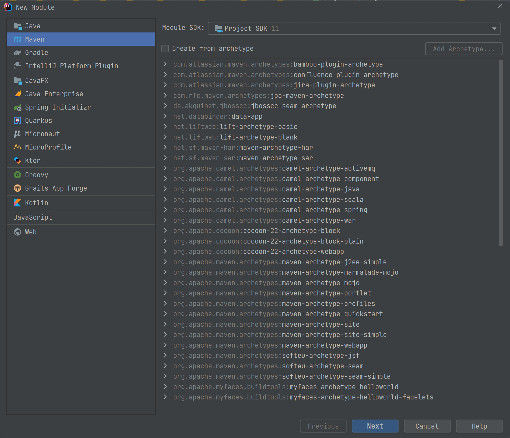
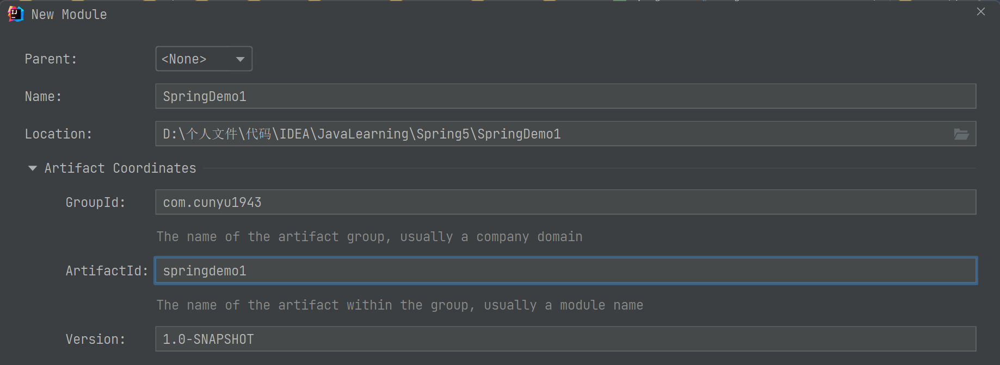
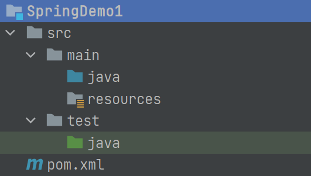
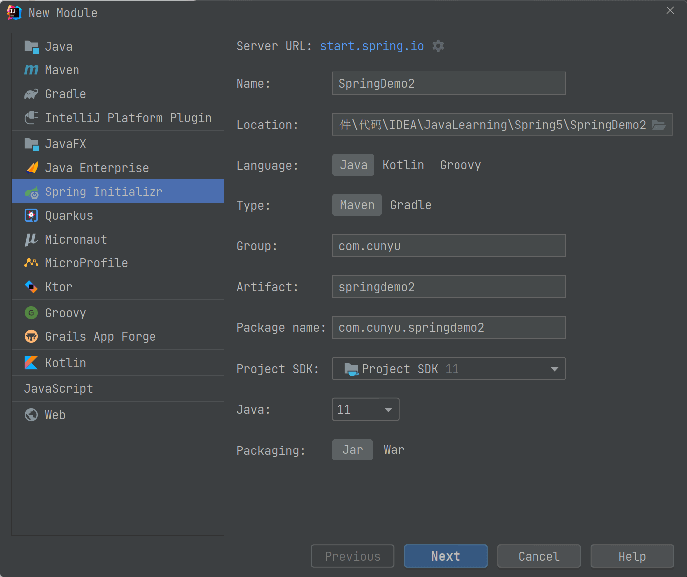
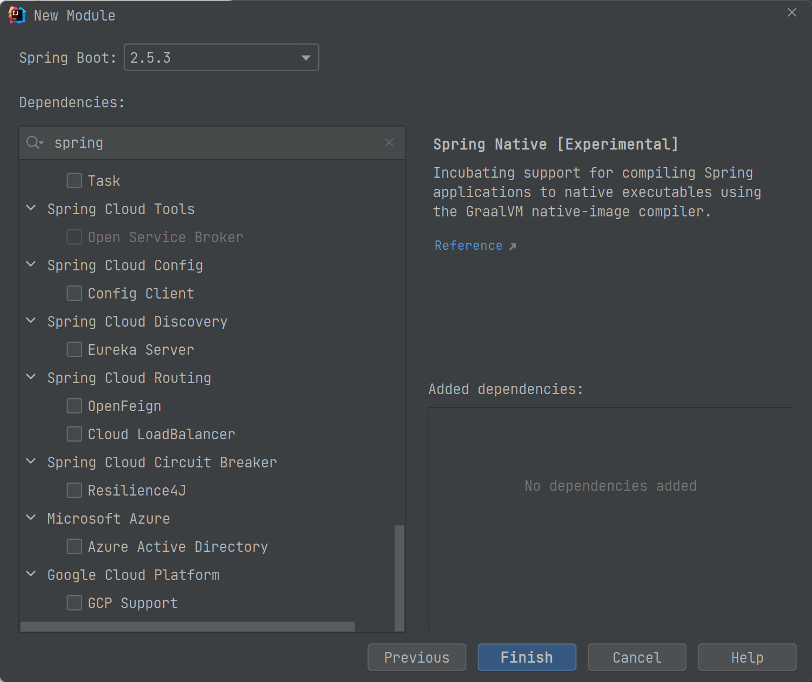
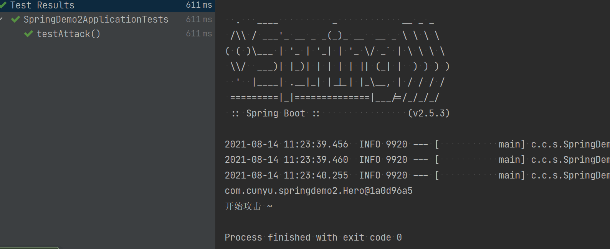
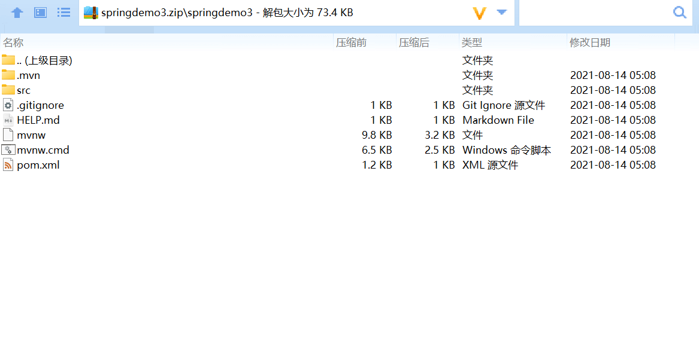

---

title: 3 种创建项目的方式
date: 2022-02-04
isOriginal: true
order: 15
icon: intellijidea
category:
    - Spring 教程
---

作者：村雨遥

博客：[studio](https://ez4jam1n.github.io/studio)

> 吾生也有涯，而知也无涯。

---

## 前言

上一篇文章中我们讲了 Spring 的相关简介，那么这一节我们就来看看，如何使用 Spring 来创建一个最简单的 `HelloWorld` 入门实例。等到我们上手之后，再去研究一下 Spring 的一些核心原理及配置。

## 创建 Spring 实例的各种方式

创建 Spring 项目的方式有很多种，最原始可以通过导包来创建，但在这里我们就直接用 Maven 来进行依赖管理，省去各种导包过程。如果你对 Maven 还不够熟悉，那么推荐你先去看看 Maven 的相关内容，我这里之前也写了 Maven 的相关文章。

### Maven 创建

1.  新建 Maven 项目；



2.  填写项目名及 Maven 坐标相关配置；



3.  点击 `Finish` 后完成项目构建，构建后的项目目录结构如下；



4.  接下来我们就是在 `pom.xml` 中添加 Spring 的相关依赖，这里主要导入 Spring 的四个核心依赖包 `Beans`、`Context`、`Core`、`Expression`。

```xml
<?xml version="1.0" encoding="UTF-8"?>
<project xmlns="http://maven.apache.org/POM/4.0.0"
         xmlns:xsi="http://www.w3.org/2001/XMLSchema-instance"
         xsi:schemaLocation="http://maven.apache.org/POM/4.0.0 http://maven.apache.org/xsd/maven-4.0.0.xsd">
    <modelVersion>4.0.0</modelVersion>

    <groupId>com.ez4jam1n</groupId>
    <artifactId>springdemo1</artifactId>
    <version>1.0-SNAPSHOT</version>

    <properties>
        <maven.compiler.source>11</maven.compiler.source>
        <maven.compiler.target>11</maven.compiler.target>
    </properties>
    <dependencies>
        <dependency>
            <groupId>org.springframework</groupId>
            <artifactId>spring-core</artifactId>
            <version>5.3.9</version>
        </dependency>
        <dependency>
            <groupId>org.springframework</groupId>
            <artifactId>spring-context</artifactId>
            <version>5.3.9</version>
        </dependency>
        <dependency>
            <groupId>org.springframework</groupId>
            <artifactId>spring-beans</artifactId>
            <version>5.3.9</version>
        </dependency>
        <dependency>
            <groupId>org.springframework</groupId>
            <artifactId>spring-expression</artifactId>
            <version>5.3.9</version>
        </dependency>
    </dependencies>
</project>
```

5.  创建一个普通类，然后类中创建一个普通方法；

```java
package com.cunyu;

/**
 * Created with IntelliJ IDEA.
 *
 * @author : zhangliang
 * @version : 1.0
 * @project : JavaLearning
 * @package : com.cunyu
 * @className : Hero
 * @createTime : 2021/8/14 10:48
 * @description : 英雄实体类
 */
public class Hero {
    private String name;
    private Integer sex;

    public void attack() {
        System.out.println("开始攻击 ~");
    }
}
```

6.  创建 Spring 配置文件，用于配置创建的对象；

Spring 配置文件一般是一个 `xml` 文件，其名字可以有我们自定义。但是要注意它的存放位置，一般是位于 `resources` 目录下，如果放在其他位置，有可能出现报错。

```xml
<?xml version="1.0" encoding="UTF-8"?>
<beans xmlns="http://www.springframework.org/schema/beans"
       xmlns:xsi="http://www.w3.org/2001/XMLSchema-instance"
       xsi:schemaLocation="http://www.springframework.org/schema/beans http://www.springframework.org/schema/beans/spring-beans.xsd">
    <bean id="hero" class="com.cunyu.Hero"></bean>
</beans>
```

7.  建立测试类进行测试；

```java
package com.cunyu;

import org.junit.Test;
import org.springframework.context.ApplicationContext;
import org.springframework.context.support.ClassPathXmlApplicationContext;

/**
 * Created with IntelliJ IDEA.
 *
 * @author : zhangliang
 * @version : 1.0
 * @project : JavaLearning
 * @package : com.cunyu
 * @className : HeroTest
 * @createTime : 2021/8/14 10:55
 * @description : 英雄测试类
 */
public class HeroTest {
    @Test
    public void testAttack() {
        //    加载 Spring 配置文件
        ApplicationContext applicationContext = new ClassPathXmlApplicationContext("ApplicationContent.xml");

        //    获取配置创建的对象
        Hero hero = applicationContext.getBean("hero", Hero.class);
        System.out.println(hero);

        hero.attack();
    }
}
```


### Spring Initializer 创建

1.  新建项目时选择 `Spring Initializer` ，并填下 Maven 坐标相关信息；



2.  这里其实严格上说是一个 SpringBoot 项目，而不是 Spring 项目，但用于 Spring 项目也可以，直接 `Finish`；



3.  同样的，我们创建实体类 `Hero`

```java
package com.cunyu.springdemo2;

/**
 * Created with IntelliJ IDEA.
 *
 * @author : zhangliang
 * @version : 1.0
 * @project : JavaLearning
 * @package : com.cunyu.springdemo2
 * @className : Hero
 * @createTime : 2021/8/14 11:18
 * @description :
 */
public class Hero {
    private String name;
    private Integer sex;

    public void attack() {
        System.out.println("开始攻击 ~");
    }
}
```

4.  然后同样在 `resources` 目录下新建 Spring 配置文件 `ApplicationContent.xml`；

```xml
<?xml version="1.0" encoding="UTF-8"?>
<beans xmlns="http://www.springframework.org/schema/beans"
       xmlns:xsi="http://www.w3.org/2001/XMLSchema-instance"
       xsi:schemaLocation="http://www.springframework.org/schema/beans http://www.springframework.org/schema/beans/spring-beans.xsd">
    <bean id="hero" class="com.cunyu.springdemo2.Hero"></bean>
</beans>
```

5.  编写测试类进行测试；

```java
package com.cunyu.springdemo2;

import org.junit.jupiter.api.Test;
import org.springframework.boot.test.context.SpringBootTest;
import org.springframework.context.ApplicationContext;
import org.springframework.context.support.ClassPathXmlApplicationContext;

@SpringBootTest
class SpringDemo2ApplicationTests {

    @Test
    void testAttack() {
        ApplicationContext applicationContext = new ClassPathXmlApplicationContext("ApplicationContent.xml");
        Hero hero = applicationContext.getBean("hero", Hero.class);
        System.out.println(hero);
        hero.attack();
    }

}
```



6.  **注意**

通过这种方式创建的 `pom.xml` 文件如下：

```xml
<?xml version="1.0" encoding="UTF-8"?>
<project xmlns="http://maven.apache.org/POM/4.0.0" xmlns:xsi="http://www.w3.org/2001/XMLSchema-instance"
         xsi:schemaLocation="http://maven.apache.org/POM/4.0.0 https://maven.apache.org/xsd/maven-4.0.0.xsd">
    <modelVersion>4.0.0</modelVersion>
    <parent>
        <groupId>org.springframework.boot</groupId>
        <artifactId>spring-boot-starter-parent</artifactId>
        <version>2.5.3</version>
        <relativePath/> <!-- lookup parent from repository -->
    </parent>
    <groupId>com.cunyu</groupId>
    <artifactId>springdemo2</artifactId>
    <version>0.0.1-SNAPSHOT</version>
    <name>SpringDemo2</name>
    <description>SpringDemo2</description>
    <properties>
        <java.version>11</java.version>
    </properties>
    <dependencies>
        <dependency>
            <groupId>org.springframework.boot</groupId>
            <artifactId>spring-boot-starter</artifactId>
        </dependency>

        <dependency>
            <groupId>org.springframework.boot</groupId>
            <artifactId>spring-boot-starter-test</artifactId>
            <scope>test</scope>
        </dependency>

    </dependencies>

    <build>
        <plugins>
            <plugin>
                <groupId>org.springframework.boot</groupId>
                <artifactId>spring-boot-maven-plugin</artifactId>
            </plugin>
        </plugins>
    </build>

</project>
```

对比通过 Maven 创建的方式，这里所添加的依赖有所不同。这是因为这种方式实际上创建的是 SpringBoot 项目，而 SpringBoot 的依赖和 Spring 有所不同，但 SpringBoot 能够实现 Spring 所具有的功能，所以这里不用再去重复添加 Spring 的相关依赖。

### 在线创建

这种方式其实和 Spring Initializer 创建的方式一样，只不过它是以网页在线的方式，然后再导入导出 IDEA 中进行后续操作。

1.  打开 https://start.spring.io/ 来生成项目；


2.  然后点击左下角生成按钮或使用快捷键 `Ctrl + Enter` 生成；
3.  将压缩包下载后，解压缩后用自己喜欢的 IDE 开发即可；



假如我们导入到 IDEA，那么接下来的步骤就是同上一种方式相同，接着就是创建实体类、配置 Spring 相关配置，最后测试类测试即可。

## 总结

好了，以上就是今天的所有内容了，主要介绍了 3 种创建 Spring 实例的方式。当然，你也可以去把 Spring 相关的依赖包进行下载后，然后导入包的方式进行项目创建，但这里更加推荐使用 Maven 的方式，方便快捷。

最后，原创不易，如果你觉得文章的内容对你有所帮助，那就点赞关注吧！
