作者：村雨遥

博客：[JavaPark](https://cunyu1943.github.io/JavaPark)

> 吾生也有涯，而知也无涯。

---

## MVC 简介

所谓 MVC（Model、View、Controller），其实是一种软件设计范式，通过将 **业务逻辑、数据、显示分离的方法来组织代码，最主要的目的是降低视图和业务逻辑代码之间的双向耦合**。其中的各部分如下：

1.  **Model（模型）**：数据模型，用于提供要展示的数据，因此包含数据和行为，现在一般分离为数据访问层（`Dao`）和服务层（`Service`）。模型提供了模型数据查询和模型数据的状态更新等功能，包括数据和业务。
2.  **View（视图）**：负责模型的展示，一般就是呈现给我们用户看的东西。

3.  **Controller（控制器）**：接收用户请求，然后委托给模型进行处理（状态改变），处理后再将返回的模型数据反馈给视图，然后由视图负责展示，即 `Controller` 充当 `Model` 和 `View` 之间的信鸽。

## Spring MVC 简介

Spring MVC 是一个用于构建 Web 应用程序的 Java 框架，遵循 **模型 - 视图 - 控制器** 设计模式。它实现了一个 Spring 核心框架的所有基本功能，如 IoC（控制反转）、DI（依赖注入）等。

Spring MVC 通过使用 `DispatcherServlet`，使得我们能够方便地在 Spring 框架中使用 MVC ，其中 `DispatcherServlet` 是一个接收传入请求并将其映射到正确的资源类。

## Spring MVC 结构

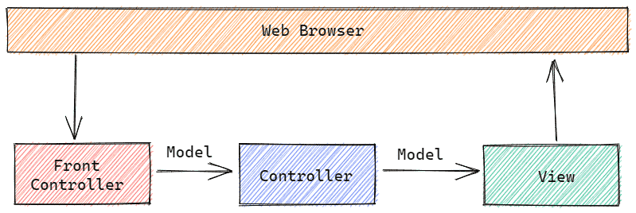

- **Model**：包含应用程序的数据，数据可以是单一对象，也可以是对象的集合；
- **Controller**：包含应用程序的业务逻辑，通常使用 `@Controller` 注解将类标记为 Controller.

- **View**：一特定格式提供的信息，通常使用 JSP + JSTL 来创建视图页面，此外，Spring 也支持 Themeleaf 和 FreeMaker 等视图技术；
- **Front Controller**：Spring MVC 中，由 `DispatcherServlet` 类充当前端控制器，负责管理 Spring MVC 应用程序的流程。

## Spring MVC 工作流程

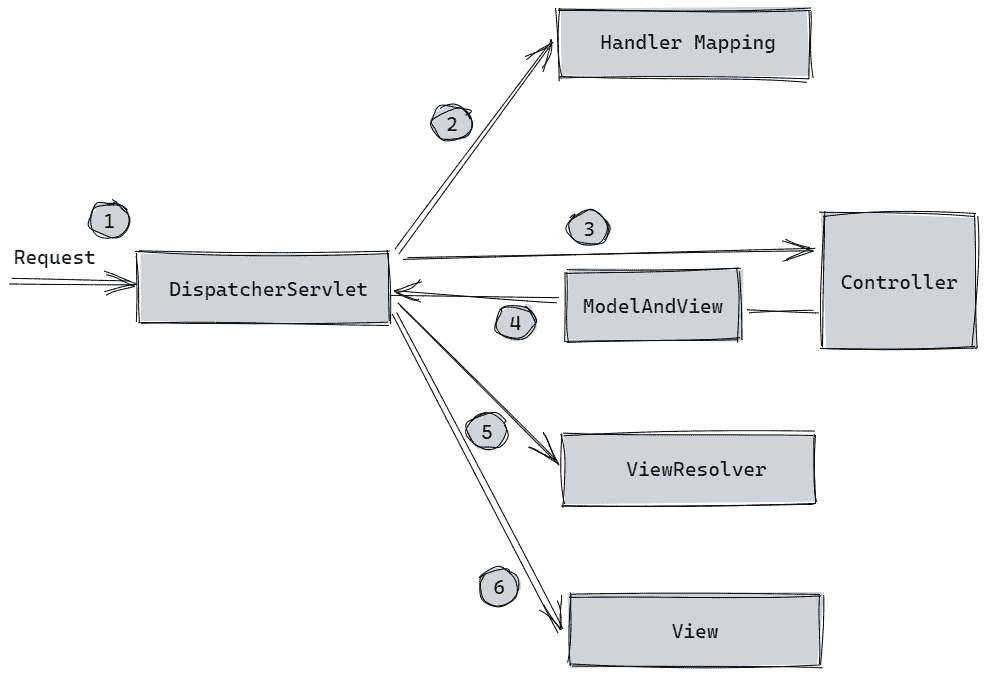

1.  如上图所示，首先，传入的请求（`request`）被工作在 **前端控制器**（`front Controller`）的 `DispatcherServlet` 接收并拦截；
2.  然后 `DispatcherServlet` 从 XML 配置文件中获取 **处理器映射器**（`Handler Mapping`）的条目，处理器根据请求找到对应 `Handler`， 同时将请求转发给控制器（`Controller`）；

3.  接着 **控制器**（`Controller`）解析返回一个 `ModelAndeView` 对象给 `DispatcherServlet` ；
4.  最后 `DispatcherServlet` 根据控制器（`Controller`）返回的对象去检查 XML 配置文件中对应的 **视图解析器**（`ViewResolver`）条目，同时调用指定的视图组件，在前端呈现出视图（`View`）。

## Spring MVC 的优势

1.  简化 Web 层的开发，易于维护；
2.  天生与 Spring 框架集成；

3.  提供强大的约定大于配置的契约式编程支持；
4.  易于对 Web 单元测试；

5.  支持灵活的 URL 到页面控制器的映射；
6.  支持静态资源；

7.  支持 RESTful 风格；
8.  灵活的数据验证、格式化和数据绑定机制，能使用任何对象进行数据绑定，不必实现特定框架 API；

9.  提供强大的 JSP 标签库，简化 JSP 开发；
10. 支持灵活的本地化、主题等解析；

11. 更加简单的异常处理；

## 如何创建一个 Spring MVC 实例

上面我们讲了 Spring MVC 的结构、工作流程以及其优缺点，下面我们就来看看，如何创建一个 Spring MVC 实例。

1.  首先创建一个普通的 Maven 项目；

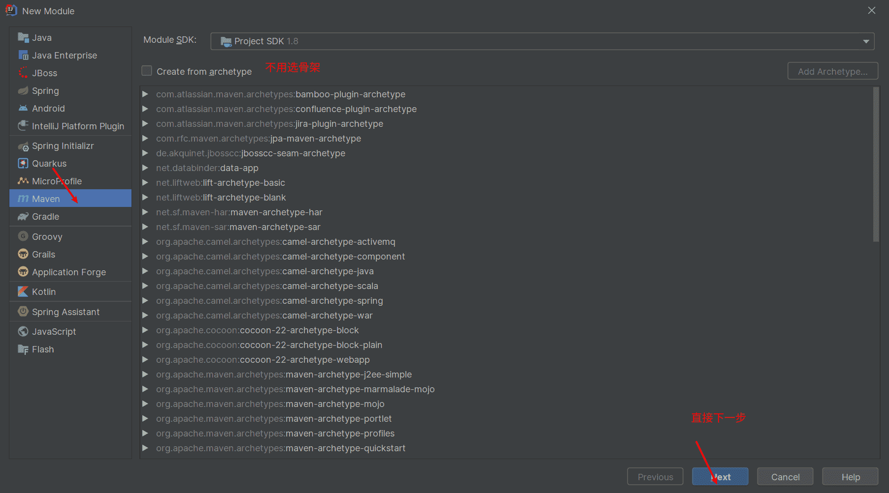

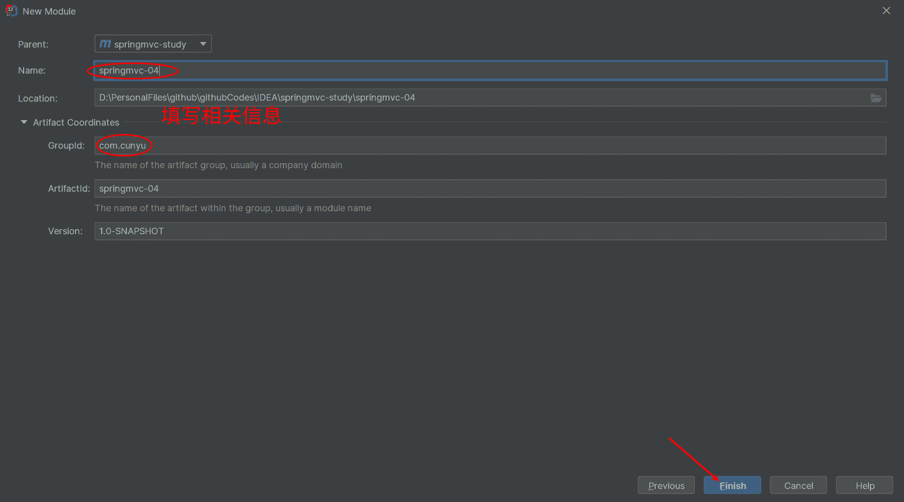

好了，完成上面两步之后，我们的普通 Maven 项目就创建 OK 了。

2.  既然是 Web 项目，那肯定得加入 Web 框架的支持，选中项目后右键，选择 `Add Framework Support`，然后选中 `Web Application` 添加即可；

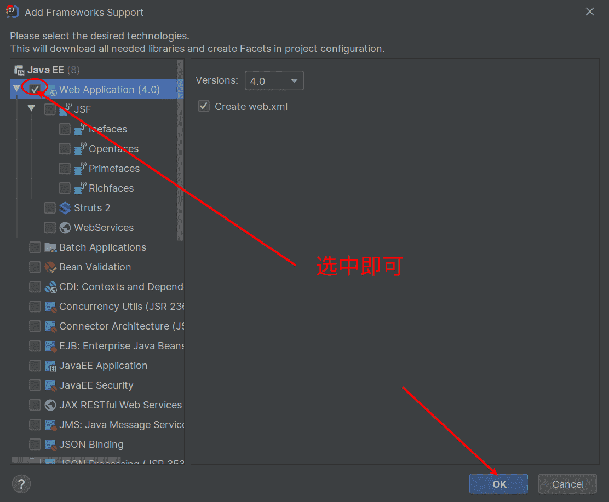

3. 创建 Maven 项目，并添加 Web 框架之后之后，我们的项目结构如下图：

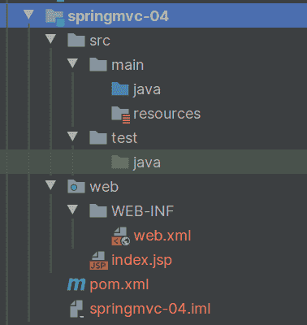

4.  接下来，在 `pom.xml` 中添加相关依赖，一般需要 Junit、Servlet、Spring MVC 等框架的依赖；

```xml
<dependencies>
    <dependency>
        <groupId>junit</groupId>
        <artifactId>junit</artifactId>
        <version>4.13</version>
        <scope>test</scope>
    </dependency>
    <dependency>
        <groupId>org.springframework</groupId>
        <artifactId>spring-webmvc</artifactId>
        <version>5.2.7.RELEASE</version>
    </dependency>
    <dependency>
        <groupId>javax.servlet</groupId>
        <artifactId>servlet-api</artifactId>
        <version>2.5</version>
    </dependency>
    <dependency>
        <groupId>javax.servlet.jsp</groupId>
        <artifactId>javax.servlet.jsp-api</artifactId>
        <version>2.3.3</version>
    </dependency>
    <dependency>
        <groupId>javax.servlet</groupId>
        <artifactId>jstl</artifactId>
        <version>1.2</version>
    </dependency>

</dependencies>
```

除此之外，为了避免后面有可能出现的静态资源导出问题，我们也可以在 `pom.xml` 添加如下配置：

```xml
<build>
    <resources>
        <resource>
            <directory>src/main/java</directory>
            <includes>
                <include>**/*.properties</include>
                <include>**/*.xml</include>
            </includes>
            <filtering>false</filtering>
        </resource>
        <resource>
            <directory>src/main/resources</directory>
            <includes>
                <include>**/*.properties</include>
                <include>**/*.xml</include>
            </includes>
            <filtering>false</filtering>
        </resource>
    </resources>
</build>
```

5.  接下来，在 `web.xml` 中注册 `DispatcherServlet`；

```xml
<servlet>
    <servlet-name>springmvc</servlet-name>
    <servlet-class>org.springframework.web.servlet.DispatcherServlet</servlet-class>

    <!--    绑定 Spring 配置    -->
    <init-param>
        <param-name>contextConfigLocation</param-name>
        <param-value>classpath:springmvc-servlet.xml</param-value>
    </init-param>
    <!--    加载顺序    -->
    <load-on-startup>1</load-on-startup>
</servlet>
<servlet-mapping>
    <servlet-name>springmvc</servlet-name>
    <url-pattern>/</url-pattern>
</servlet-mapping>
```

同时在 `/src/main/resources` 目录下新建一个 Spring MVC 配置文件 `springmvc-servlet.xml` （文件名可以自定义，可以根据自己喜好自定义）；

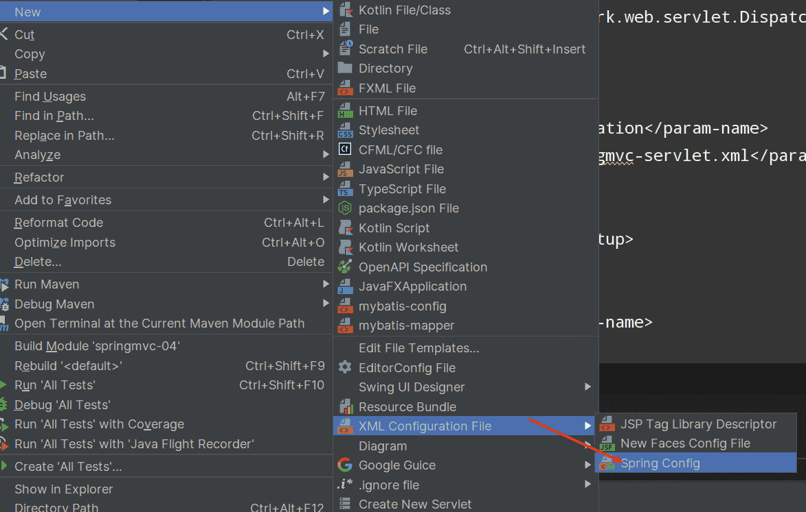

6. 配置 Spring MVC 的配置文件，即上一步中所创建的 `springmvc-servlet.xml`；

```xml
<?xml version="1.0" encoding="UTF-8"?>
<beans xmlns="http://www.springframework.org/schema/beans"
       xmlns:xsi="http://www.w3.org/2001/XMLSchema-instance"
       xmlns:context="http://www.springframework.org/schema/context"
       xmlns:mvc="http://www.springframework.org/schema/mvc"
       xsi:schemaLocation="http://www.springframework.org/schema/beans http://www.springframework.org/schema/beans/spring-beans.xsd http://www.springframework.org/schema/context https://www.springframework.org/schema/context/spring-context.xsd http://www.springframework.org/schema/mvc https://www.springframework.org/schema/mvc/spring-mvc.xsd">
    <!--  自动扫描，由 IOC 统一管理  -->
    <context:component-scan base-package="com.cunyu.controller"/>
    <!--Spring MVC 不处理静态资源-->
    <mvc:default-servlet-handler/>
    <!--  支持 MVC 注解驱动  -->
    <mvc:annotation-driven/>

    <!--  视图解析器，此处的为 Spring 自带，也可以使用其他解析器  -->
    <bean class="org.springframework.web.servlet.view.InternalResourceViewResolver" id="internalResourceViewResolver">
        <!--    前后缀    -->
        <property name="prefix" value="/WEB-INF/jsp/"/>
        <property name="suffix" value=".jsp"/>
    </bean>
</beans>
```

7.  创建控制类 Controller

```java
package com.cunyu.controller;

import org.springframework.stereotype.Controller;
import org.springframework.ui.Model;
import org.springframework.web.bind.annotation.GetMapping;
import org.springframework.web.servlet.ModelAndView;

import java.util.Scanner;

/**
 * @author : cunyu
 * @version : 1.0
 * @className : HelloController
 * @date : 2020/7/21 8:19
 * @description : 控制器
 */

@Controller
public class HelloController {
    // 浏览器访问 ip:port/项目名/hello
    @GetMapping("/hello")
    public String sayHello(Model model) {
        String name = "村雨遥";
        model.addAttribute("name", name);
        // 访问 /WEB-INF/jsp/hello.jsp
        return "hello";
    }
}
```

8.  创建视图层，在 `WEB-INF/jsp` 目录下新建 `hello.jsp`（没有的目录和文件需要自己创建），然后就可以取出 `Controller` 中 `Model` 所存放的值或者对象；

```jsp
<%--
  Created by IntelliJ IDEA.
  User: cunyu
  Date: 2020/7/21
  Time: 8:23
  To change this template use File | Settings | File Templates.
--%>
<%@ page contentType="text/html;charset=UTF-8" language="java" %>
<html>
<head>
    <title>村雨遥的博客</title>
</head>
<body>
你好，${name}，欢迎来到我的博客！
</body>
</html>
```

9.  以上步骤都配置好之后，接下来就去配置 Tomcat；

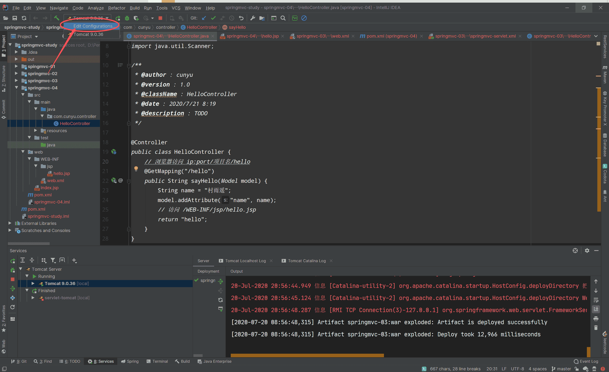

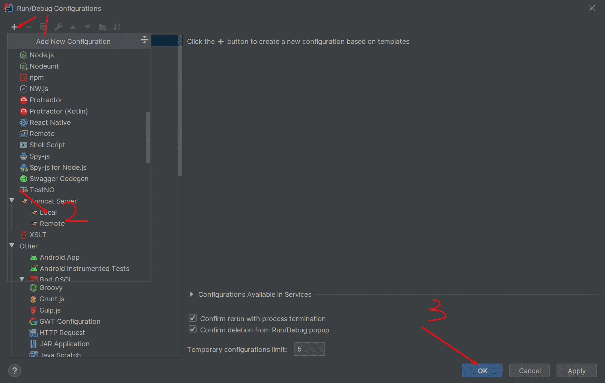

填写相关配置，同时点击 `Fix`

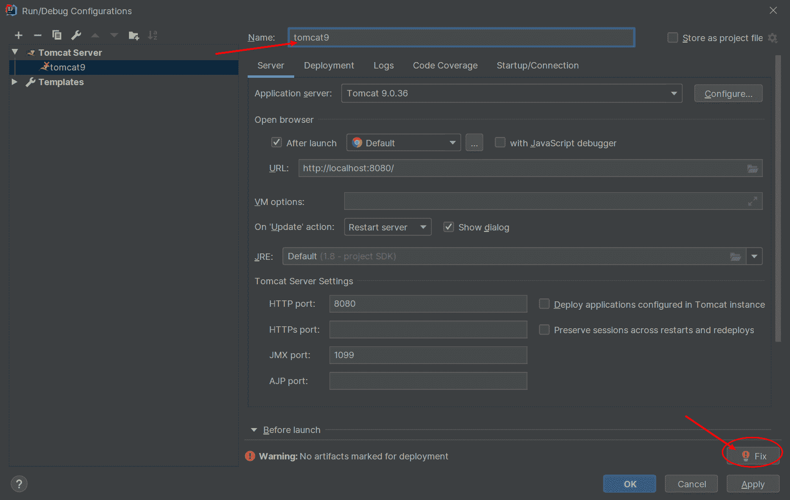


10. 点击启动 Tomcat，然后在浏览器中访问 `localhost:8080/hello`


## 注意事项

按照上述步骤操作后如果出现访问不了的情况，可以按照如下步骤进行设置：

1.  依次进入 `Project Structure -> Artifacts`

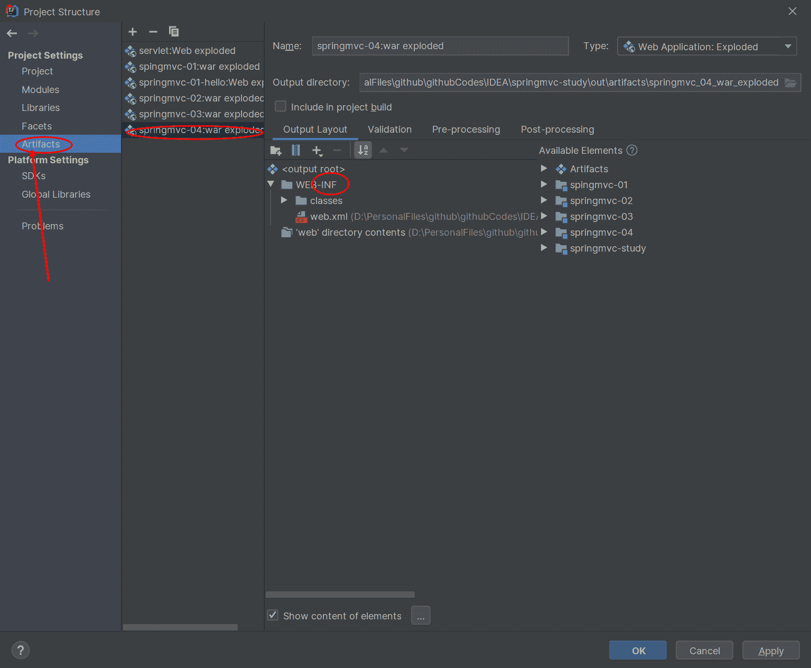

2.  在 `WEB-INF` 目录新建 `lib` 目录，然后将所有 `Library Files` 添加到 `lib` 目录，然后重启 Tomcat 即可；

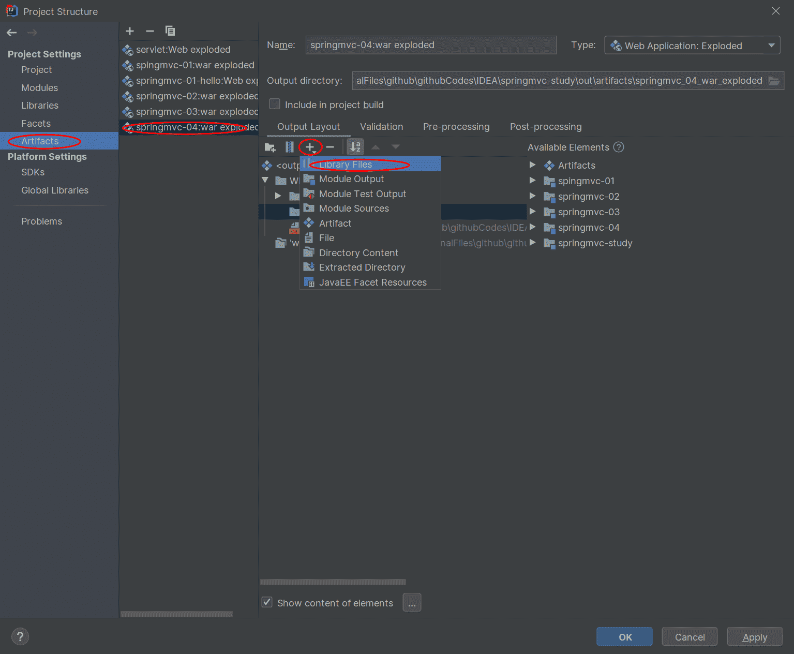

## 总结

以上就是 Spring MVC 的相关简介以及如何利用 IDEA 来创建一个 Spring MVC 实例的所有内容了。原创不易，如果你觉得我的文章对你有所帮助，那就帮忙点赞关注一波吧！
