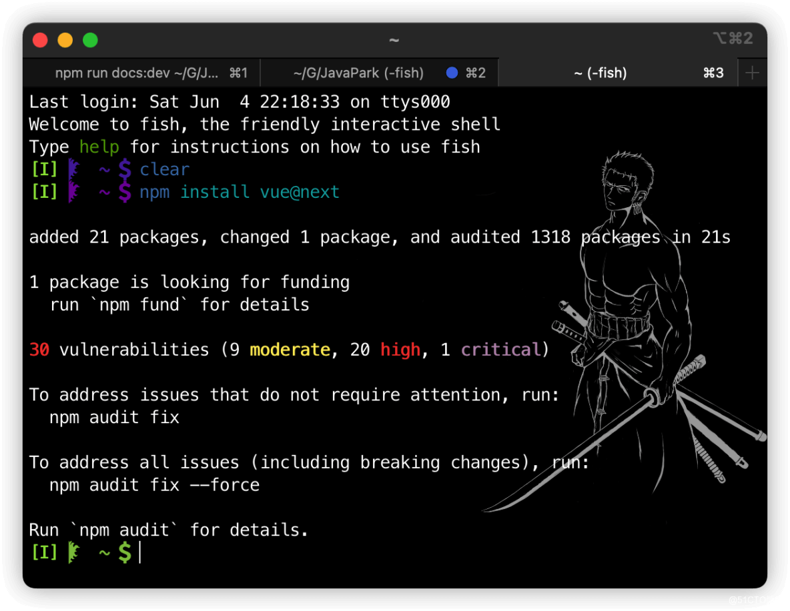

作者：村雨遥

博客：[JavaPark](https://cunyu1943.github.io/JavaPark)

> 吾生也有涯，而知也无涯。

---

## 前言

之前已经学习过来 `HTML`、 `CSS` 以及 `JavaScript` 的相关知识，也算是基本了解了关于这前端三件套的一些基本用法。今天就来了解下，当前前端开发中最炙手可热的当红辣子鸡 - `Vue`。本文主要介绍 `Vue` 的一些入门知识和最经典的 `Vue` 入门 `Hello World` 程序，如果你想了解的是更高级的使用技巧，那么完全可以忽略。

## Vue 简介

### Vue 是什么

`Vue` 是一套用于构建用户界面的 **渐进式框架**，不同于其他框架， `Vue` 被设计为可以自底向上逐层应用，核心库只关注视图层，具有易上手，与第三方库整合方便等优点。此外， `Vue` 还支持多种现代化的工具链以及类库，使得它能够为复杂的单页应用提供驱动。

### Vue 的特点

1.  采用组件化模式，从而提高了代码复用率，更容易维护。
1.  声明式编码，程序员无需直接操作 `DOM` ，从而提高开发效率。
1.  利用虚拟 `DOM` + 优秀 `Diff` 算法，最大化复用 `DOM` 节点。

### Vue 的安装

Vue 的安装主要有两种方式，一种是通过在文件中直接用 `<script>` 标签引入的方式，另一种则是则是使用 `npm` 的方式，接下来我们就来看看两种方式是如何进行安装的。

**标签引入的方式**

假设我们创建了一个 HTML 文件，那么我们此时只需要引入其中以下两个版本中其中一个就可以了。而两者的区别顾名思义，所谓开发环境版本，就是我们日常开发学习所使用的版本，它包含了完整的警告和提示模式，方便我们定位错误，提高我们的开发效率。而生产环境版本，则是对开发环境进行了精简，剔除了其中的警告，尽可能优化了尺寸和速度，针对上线生产所用，有助于生产环境效率的提升。针对生产环境版本，更加推荐大家链接到一个明确的版本号和构建文件，从而避免新版本对老版本中特性造成破坏，影响用户体验。

- 开发环境版本

```sh
<script src="https://unpkg.com/vue@next"></script>
```

- 生产环境版本

```sh
<script src="https://cdn.bootcdn.net/ajax/libs/vue/3.2.33/vue.cjs.js"></script>
```

2.  **npm 安装**

以上的两种方式更适合于我们日常学习和小型应用开发，而如果我们要使用 Vue 构建大型应用时，官方更加推荐我们使用 NPM 进行安装，它能够更好的配合类似 `webpack` 、 `Rollup` 等打包器的使用，而且 Vue 也提供了配套的工具来进行单文件组件的开发，而安装的方式也很简单，只要我们的电脑上安装了 Node.js，那我们就可以通过命令行来进行最新稳定版 Vue 的安装了，安装的命令如下。

```sh
npm install vue@next
```



## Vue 入门实例

首先，我们创建一个 `.html` 文件，用于交互。

```html
<!DOCTYPE html>
<html lang="en">

  <head>
    <meta charset="UTF-8">
    <meta http-equiv="X-UA-Compatible" content="IE=edge">
    <meta name="viewport" content="width=device-width, initial-scale=1.0">
    <title>Document</title>
  </head>

  <body>

  </body>

</html>
```

接着我们引入 `Vue3` 的相关包，这里引入的方式和之前 `JavaScript` 中介绍的引入的方式一样，直接在 `head` 部分进行引入即可。

```html
<!-- 引入 Vue3 -->
<script src="https://unpkg.com/vue@next"></script>
```

然后就是在 `body` 标签中添加模板用于将数据渲染到 `DOM` 的系统。

```js
const app = {
    data() {
        return {
            message: 'Hello World!'
        }
    }
}
Vue.createApp(app).mount('#app')
```

最后得到我们的完整文件如下。

```html
<!DOCTYPE html>
<html lang="en">

  <head>
    <meta charset="UTF-8">
    <meta http-equiv="X-UA-Compatible" content="IE=edge">
    <meta name="viewport" content="width=device-width, initial-scale=1.0">
    <title>Vue 3 入门实例</title>
    <!-- 引入 Vue3 -->
    <script src="https://unpkg.com/vue@next"></script>
  </head>

  <body>
    <div id="app">
      {{message}}
    </div>

    <script>
      const app = {
        data() {
          return {
            message: 'Hello World!'
          }
        }
      }
      Vue.createApp(app).mount('#app')
    </script>
  </body>

</html>
```

将文件用浏览器打开，在页面中应该就会显示如下信息了。


以上就是一个最简单的 `Vue` 入门小案例，如何在网页中打印 `Hello World！` 。虽然看起来十分简单，和我们用 `HTML` 中的字符串模板来实现相同的效果也十分类似，但实际上 `Vue` 在背后做了许多我们看不见的工作。

## 总结

以上就是今天的所有内容了，主要从两个方面着手，一方面从 `Vue` 的定义、特点、安装来对 `Vue` 进行了介绍，另一方面则用一个最简单经典的 `Hello World！` 入门小案例来向大家简单介绍下 `Vue` 的使用方式。