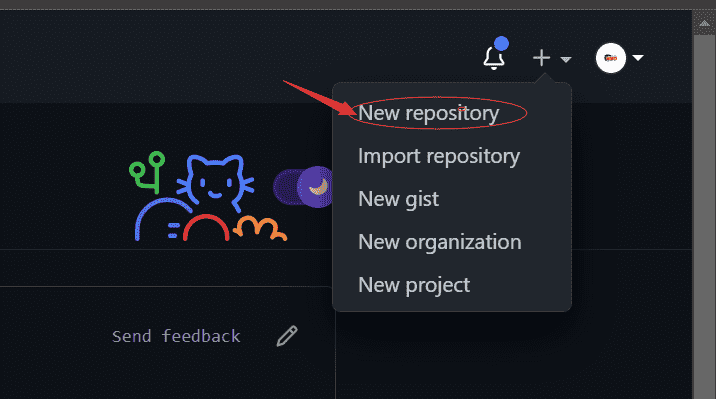
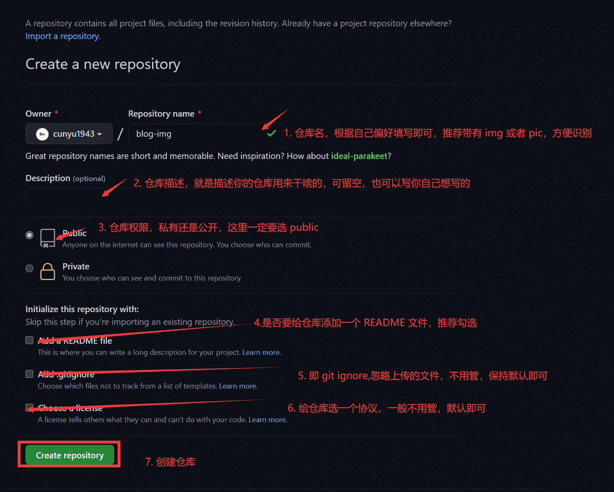
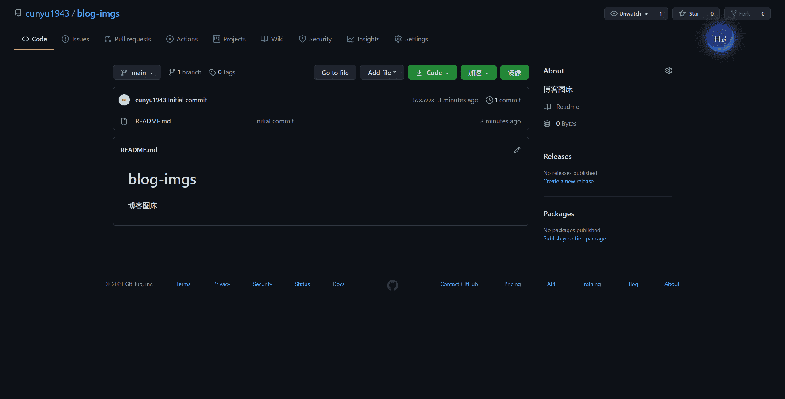
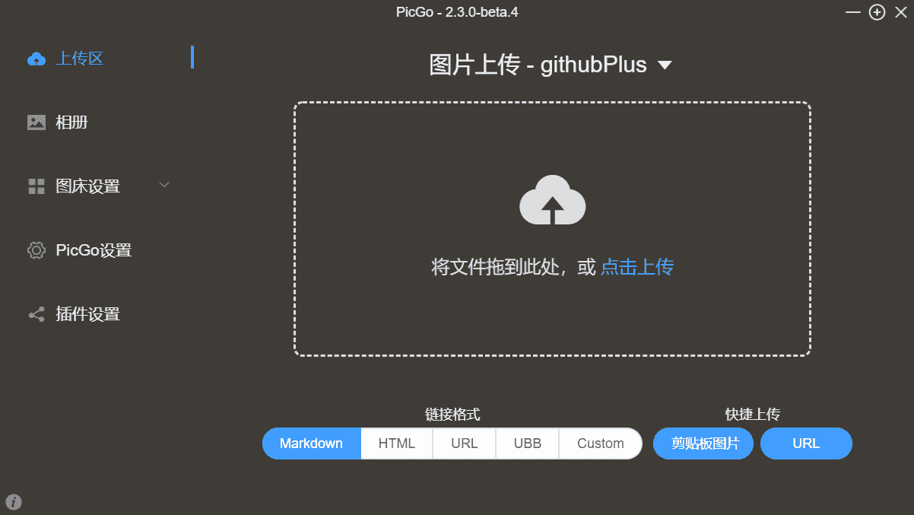
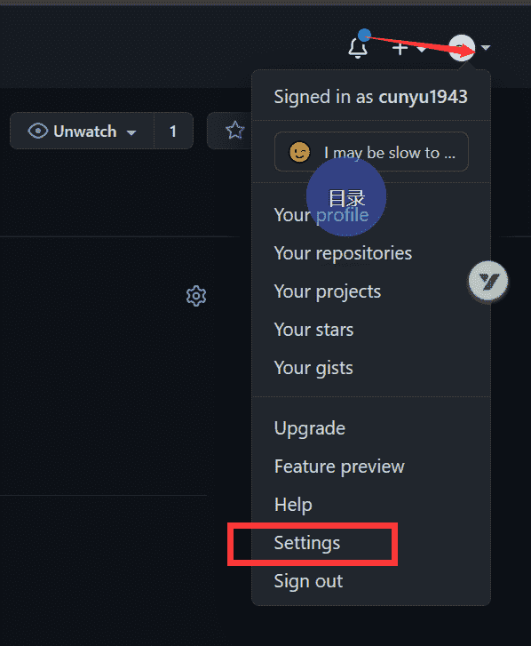
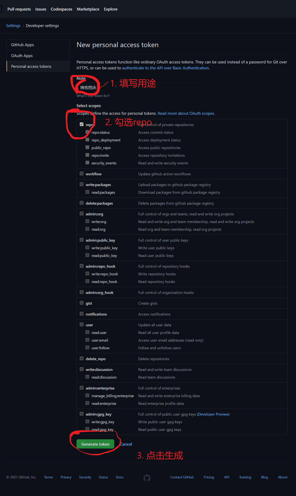
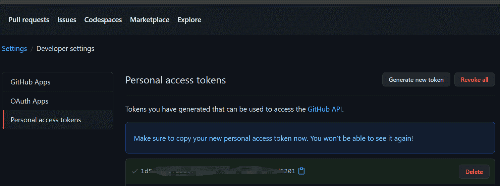
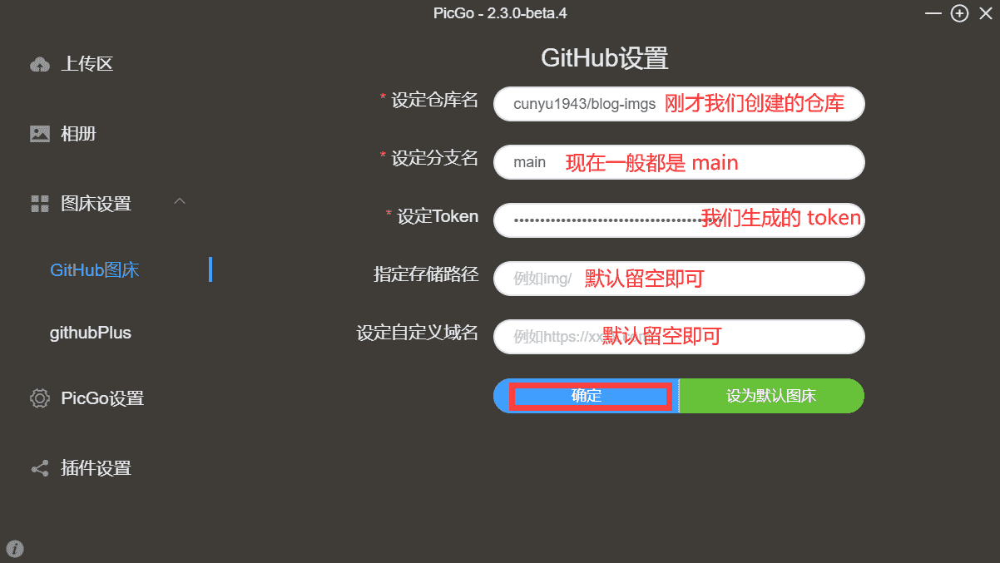
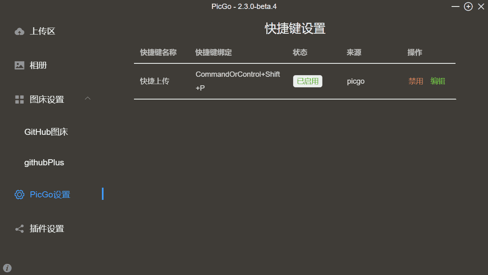
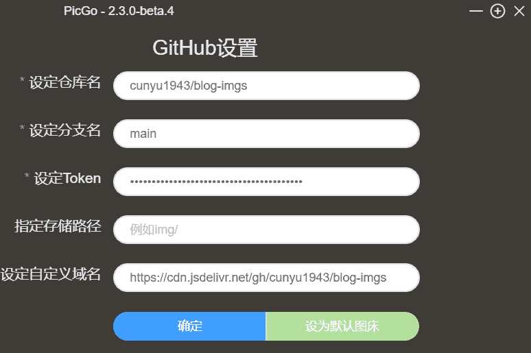

作者：村雨遥

博客：[JavaPark](https://cunyu1943.github.io/JavaPark)

> 吾生也有涯，而知也无涯。

## 前言

对于写博客的朋友们来讲，图床这个东西一定不会陌生，而且在一定程度上也给大家造成过一定困扰。

对于不清楚这个东西的朋友，我就在这儿大概说一下图床是个啥东西。所谓图床，其实可以就相当于我们手机上的相册，不过它是在线的，而且是对大家开放的，大家都可以访问查看，但是编辑删除这些功能仅限于拥有者，就相当于用百度云分享的公开照片，你可以查看，也可以下载下来编辑，但是拥有权还是属于分享者。

那你可能会疑惑，那这个东西和写博客的我们有啥关系呢？

你想想，我们写博客，是不是有很多图片需要插入，我们这些博客要保留在本地的时候你可以预览到图片，但一旦你要把它发布到网上，这时候问题来了！发现图片上传失败，那是因为你本地的图片都是存在本地的，平台不会自动给你上传，那这个时候就凸显出图床的重要性了。当然了，如果你是直接在平台进行编辑，那着一点就不用担心了，基本平台都会自动给你上传到它自己的服务器。

有了图床，我们在本地写好博客之后，就能够任意复制到其他平台，不用担心图片丢失问题了。

今天的文章就是给大家分享一个搭建免费图床的教程，既是方便自己后续的复习，也希望对大家也有所帮助。

## 准备工作

那么在正式开始之前，你需要提前准备以下东西：

> 一个 Github 账号

好了，就这么简单，只要你有一个 Github 账号就够了，你就能拥有一个免费的图床了，如果你还没有，那赶紧去 [注册](https://github.com/cunyu1943) 一个账号吧。

## 搭建过程

这一部分就是正式开始搭建过程了，准备好大干一场吧！

1.  登录你的 Github 之后，创建一个新的仓库。

2.  填写仓库先关资料，一般只需要选一个合适的仓库名，然后确保仓库为 `public` 其他的保持默认就好；

3.  一般创建成功之后，会出现如下界面，至此，我们的图床算是创建好了，接下来就是如何上传图片了。

## 上传图片

通过上面的步骤，我们的图床时搭建好了，但是通过传统的方法向 Github 上传图片太麻烦了，这里我们推荐使用一个开源图床工具 [PicGo](https://molunerfinn.com/PicGo/) 来作为我们的图片上传工具；

PicGo 的安装就不说了，去他的 [官网](https://molunerfinn.com/PicGo/) 下载对应版本进行安装即可，我们主要讲讲如何用它来上传图片。安装后，打开软件其主页面如下：

接下来就是配置 PicGo 的过程了。

1.  首先，我们先要去 Github 创建一个 token；

以此打开 `Settings -> Developer settings -> Personal access tokens`，最后点击 `generate new token`；

2.  填写及勾选相关信息，然后点击 `Genetate token` 即可；

3.  `token` 生成，注意它只会显示一次，所以你最好把它复制下来到你的备忘录存好，方便下次使用，否则下次有需要重新新建；

4.  配置 PicGo，依次打开 图床设置 -> Github 图床；

5.  填写相关信息，最后点击 `确定`即可，要将其作为默认图床的话，点击设为默认图床；

6.  上传图片，通过上传区上传即可（Ctrl V 或者将图片拖拽都可以），也可以通过快捷键的方式上传（默认上传键为 `Ctrl + Shift + P`）；

## 加速访问

大家可能会发现，我们上传到 Github 的图片有时候访问太慢了，有时候甚至直接加载不出来！那该咋办呢？

这时候我们就可以用 [jsDelivr](https://www.jsdelivr.com/) 进行免费加速，而设置的方法也很简单，只需要在我们 PicGo 图床配置中添加如下自定义域名即可；

> `https://cdn.jsdelivr.net/gh/用户名/仓库名`

比如我的就是 `https://cdn.jsdelivr.net/gh/cunyu1943/blog-imgs`

## 图床推荐

除开用 Github 搭建的方式之后，我们也可以用 Gitee 进行搭建，搭建方式和本文大致相同。此外，我也推荐几个免费的图床给大家，大家可以根据自己的喜好进行选择；

1.  [路过图床](https://imgchr.com/)
2.  [SM.MS](https://sm.ms/)
3.  [Imgur](https://imgur.com/)

## 总结

至此，我们的搭建免费图床的教程就到此结束了，总结一下主要有如下几部分：

1.  准备一个 Github 账号；
2.  搭建图床仓库；
3.  上传图片设置；
4.  加速访问；
5.  免费图床推荐；

如果你对上面的部分有疑问，欢迎留言或者私信，我会在看到的第一时间回复你！
