作者：村雨遥

博客：[studio](https://ez4jam1n.github.io/studio)

> 吾生也有涯，而知也无涯。

## 准备工作

### Ubuntu

- 获取地址：

- [官网](https://ubuntu.com/download/desktop)

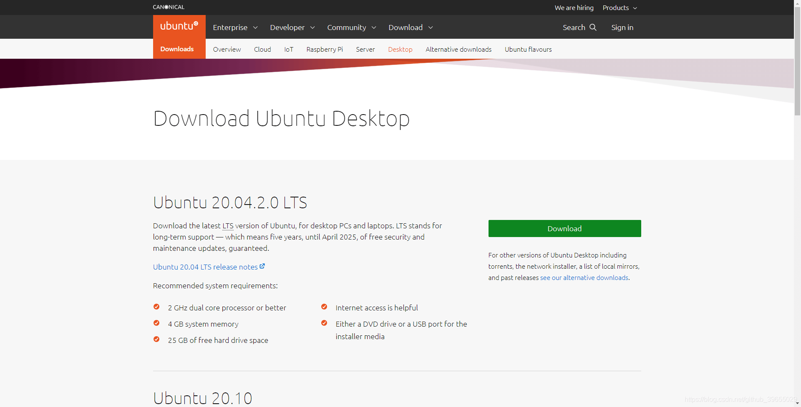

- [清华镜像站](https://mirrors.tuna.tsinghua.edu.cn/ubuntu-releases/21.04/)

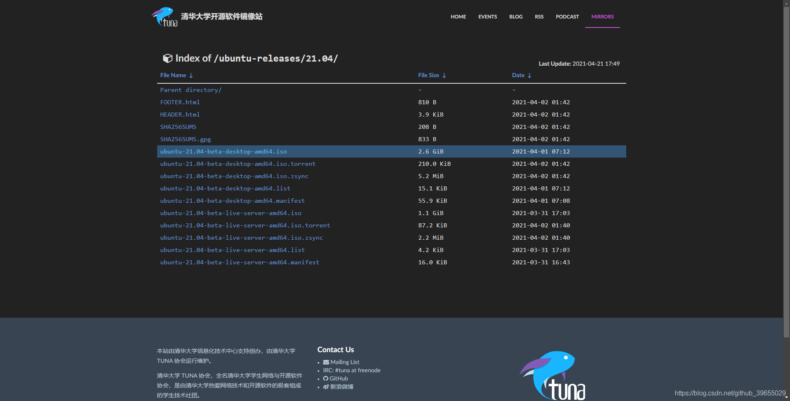

### VMware

- [官网](https://my.vmware.com/cn/web/vmware/downloads/info/slug/desktop_end_user_computing/vmware_workstation_pro/16_0)

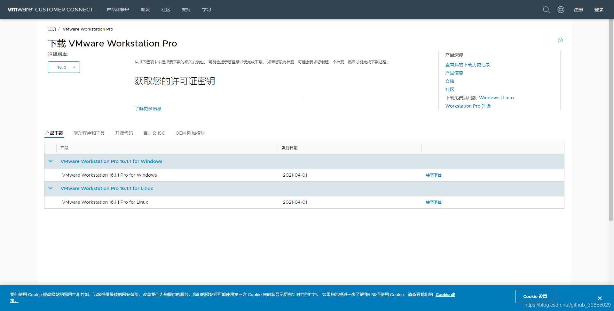

## 安装过程

Vmware 的安装过程此处不在赘述，不清楚如何安装的请自行百度，参见 [VMware14 安装教程](https://blog.csdn.net/qq_40950957/article/details/80467513)，其他版本的安装也一样，只不过版本版本不同而已，但是步骤没啥变化。

然后就是 Vmware 中安装 Ubuntu 的过程如下：

1.  首先新建一个虚拟机，配置选典型即可，然后下一步；

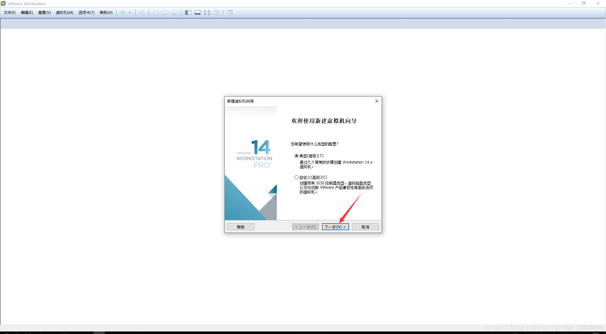

2.  选择稍后安装操作系统，接着下一步；

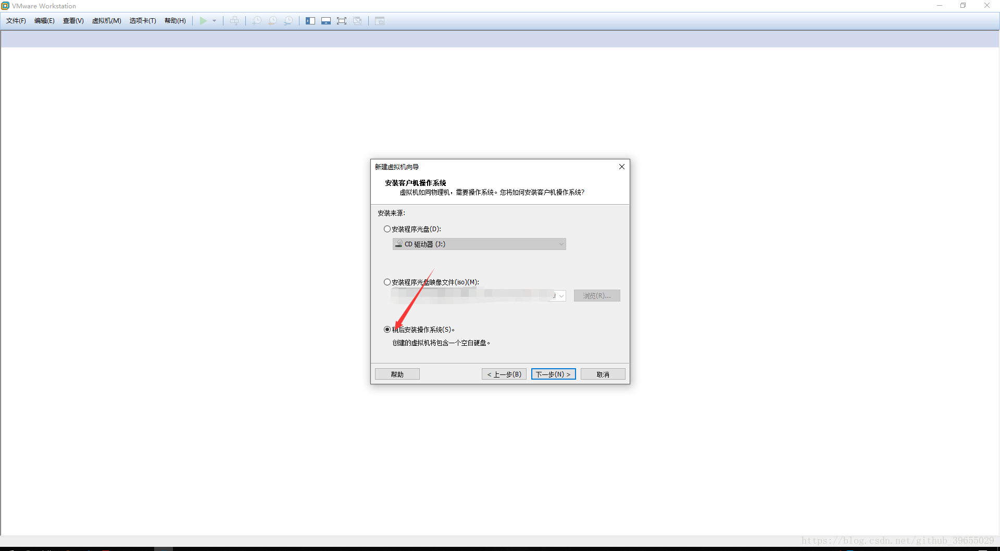

3.  然后操作客户机系统类型选 Linux，接着在下边的下拉框中选择你对应版本的系统；

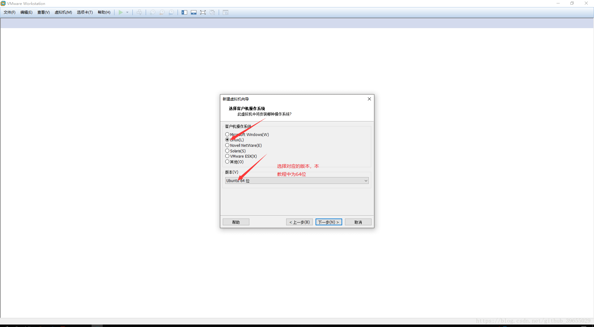

4.  为你的虚拟机命名，并且选择存放地址，接着下一步；

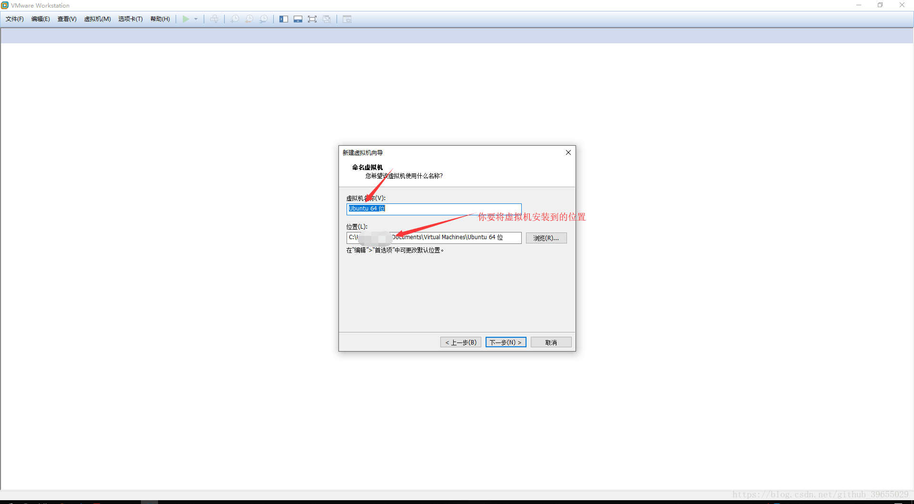

5.  选择磁盘大小，建议选择 20 GB 以上；

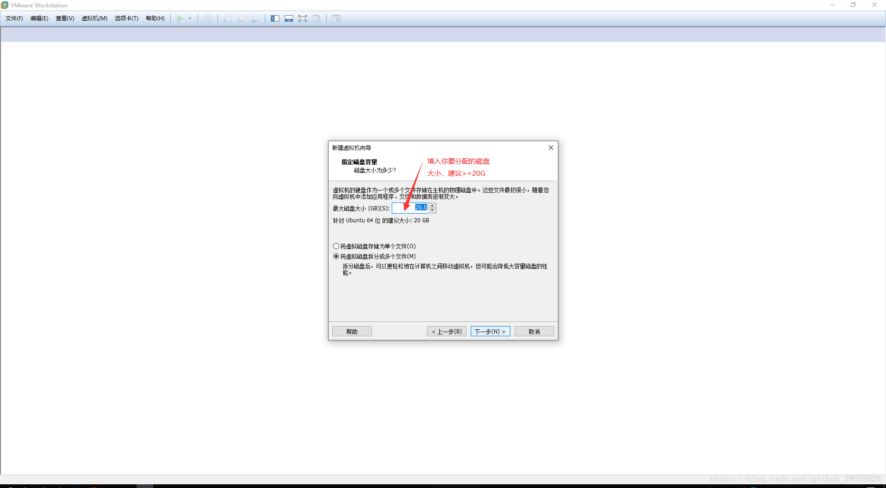

6.  接着自定义硬件，把不需要的硬件干掉；

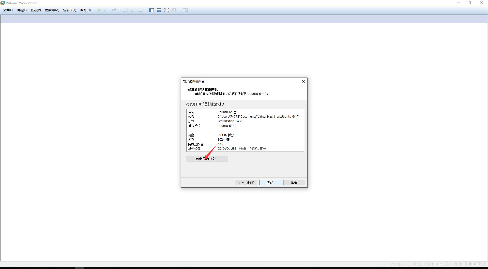

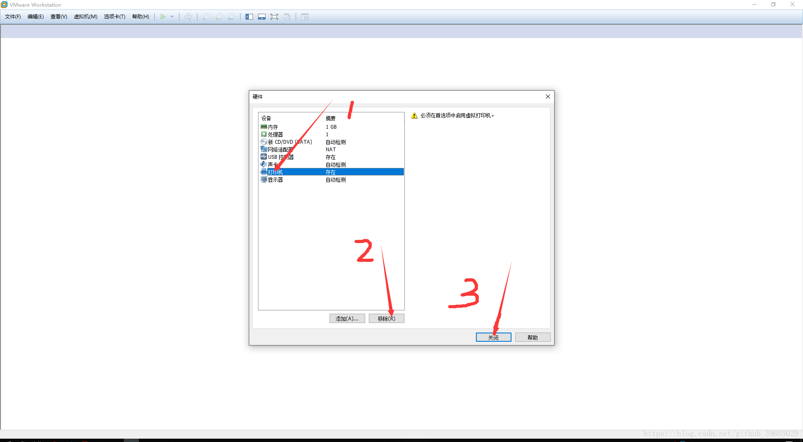

7.  干掉不必要的硬件之后，直接选择完成；

8.  编辑虚拟机的相关设置；

9.  选择虚拟机内存，这个要根据自己的机器来选，不要搞太高，不然会跑不起来的，直接把你本机搞死。

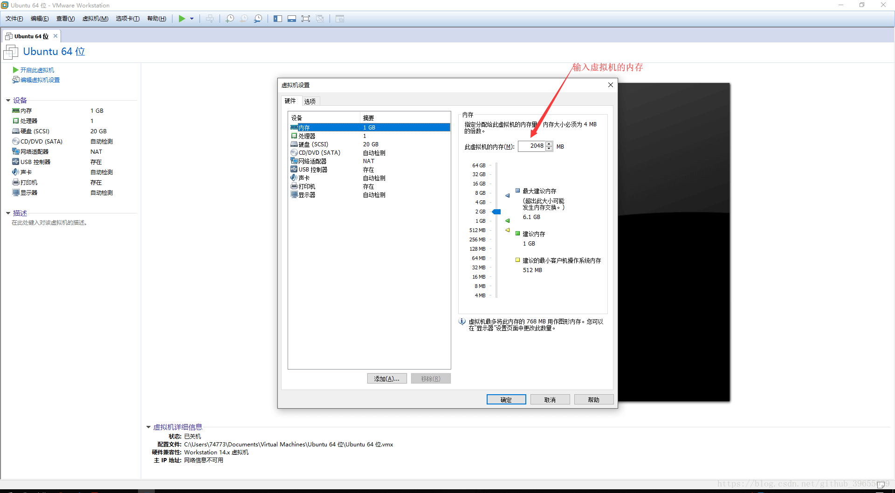

10.  接着就是选择你系统镜像文件的地址；

11.  完成各个设置之后，点击开启此虚拟机；

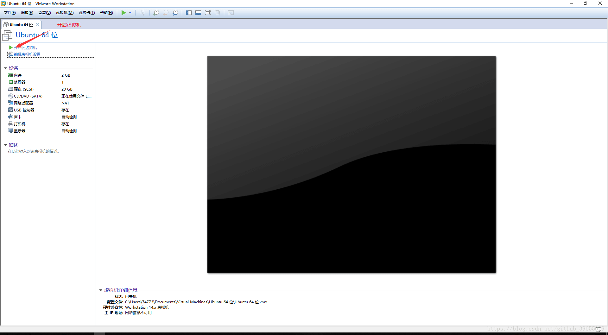

12.  选择中文（当然你也可以选择英语），然后点击安装；

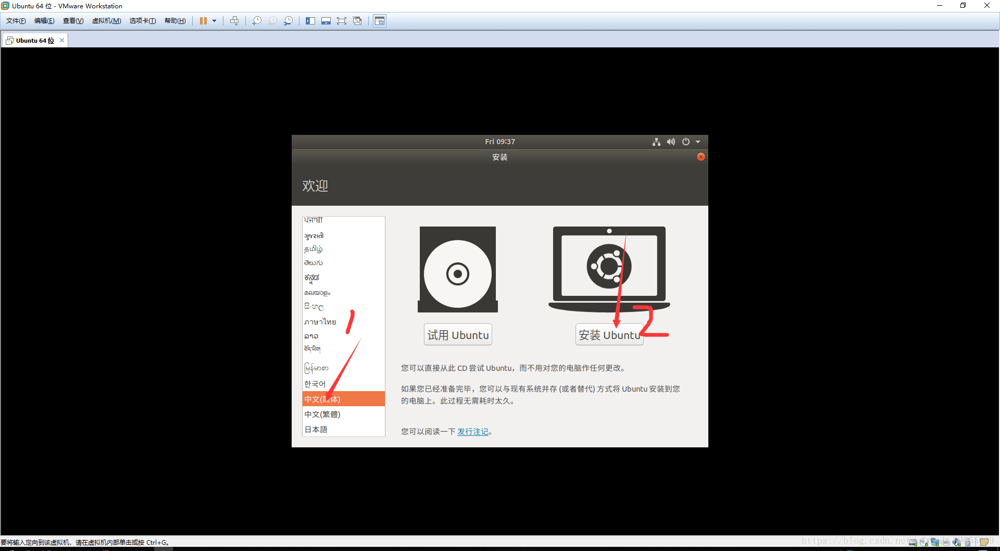

13.  接着选键盘布局，我们一般都是选汉语就 ok；

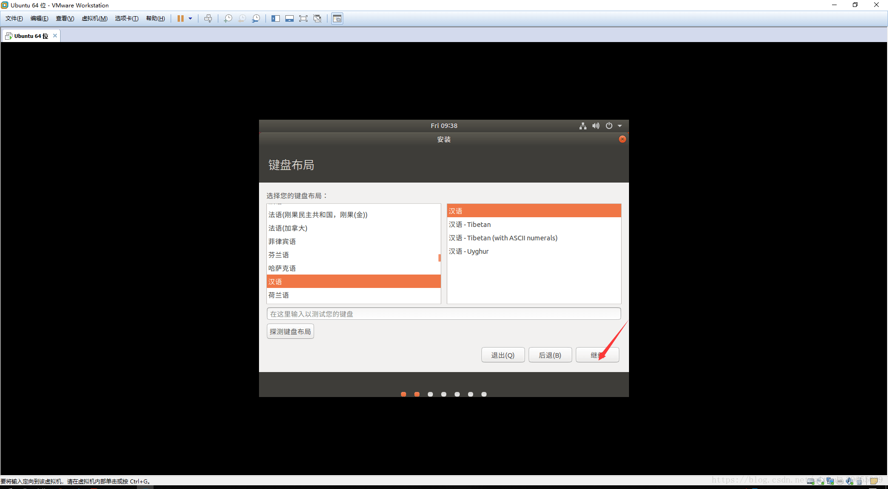

14.  选择正常安装，对于是否更新和安装其他软件，为了安装的更快，选择不要下载更新；

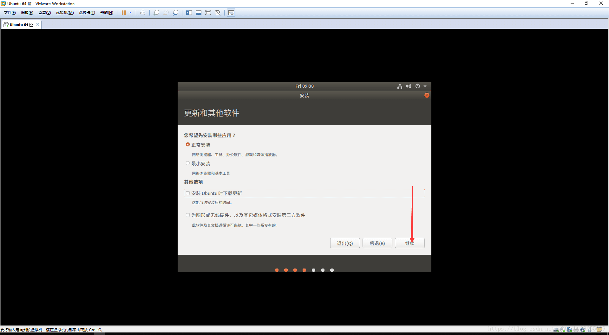

15.  选择清除整个磁盘并安装；

16. 填写计算机名、用户名，并设置用户密码；

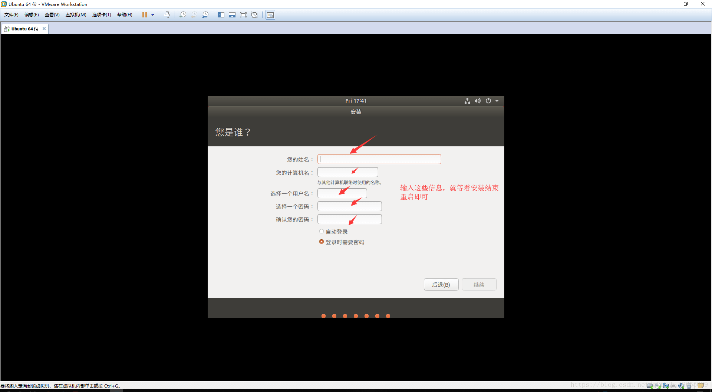

17. 填写完上面的信息之后，等待一段时间安装，然后重启即可。重启后进入如下界面，只需要输入我们设置的用户密码尽快进入系统。

## 总结

至此，Ubuntu 在 VMware 中的安装过程就结束了，接下来你就可以尽情的捣鼓安装好的系统了 😜.
