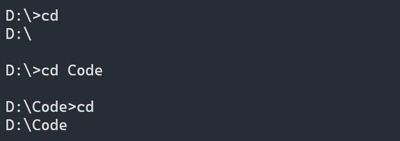
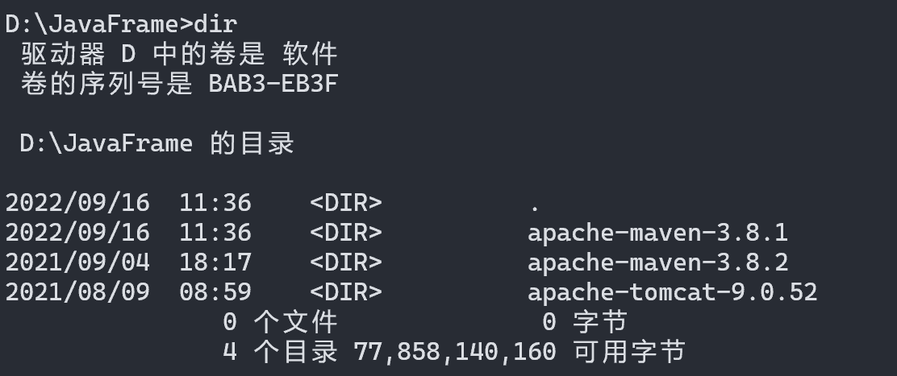
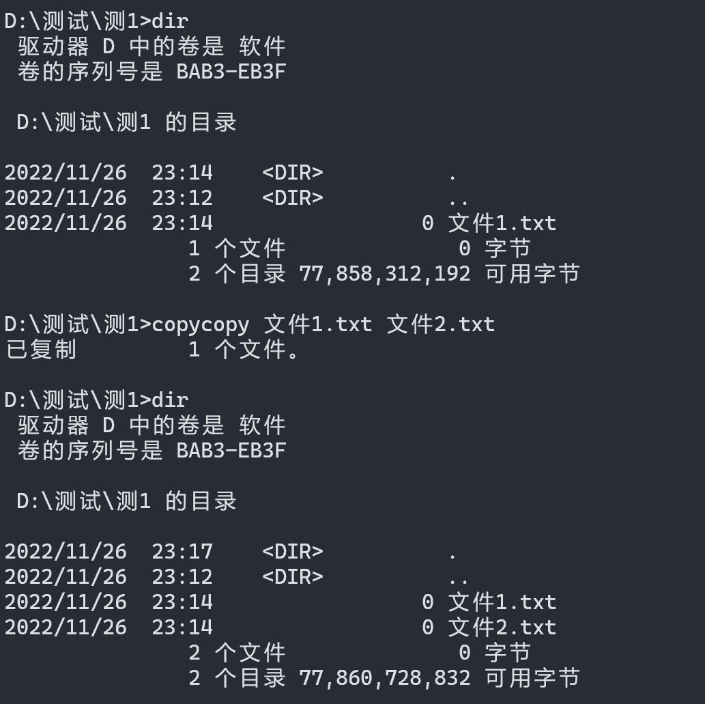
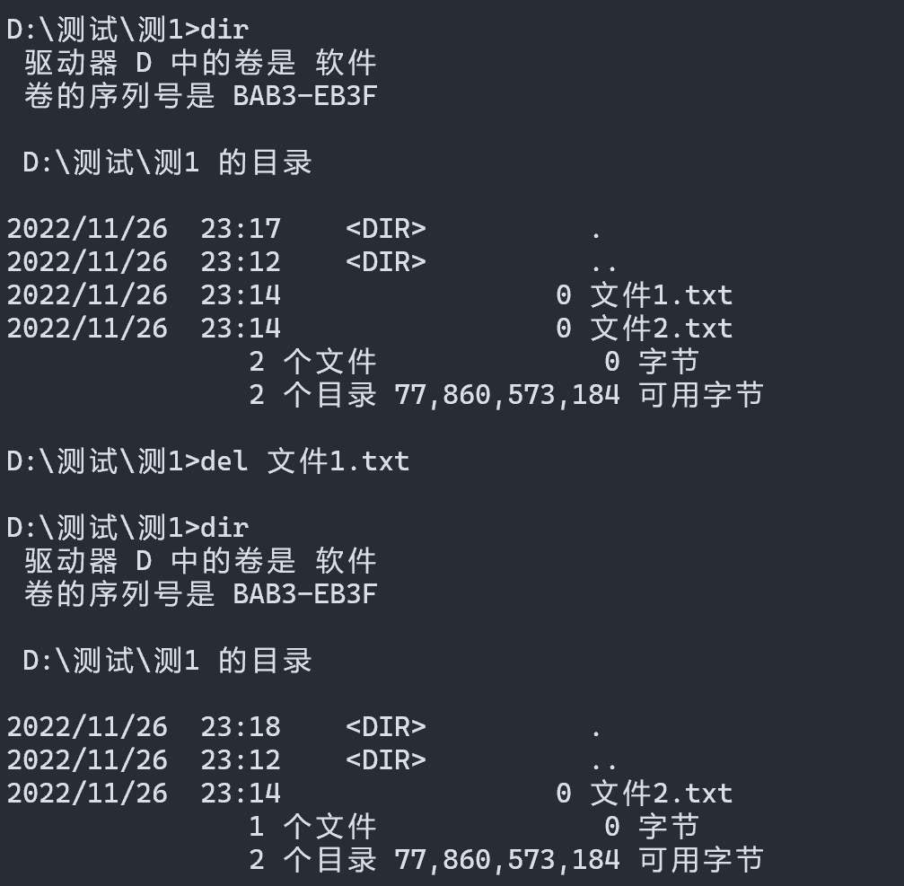
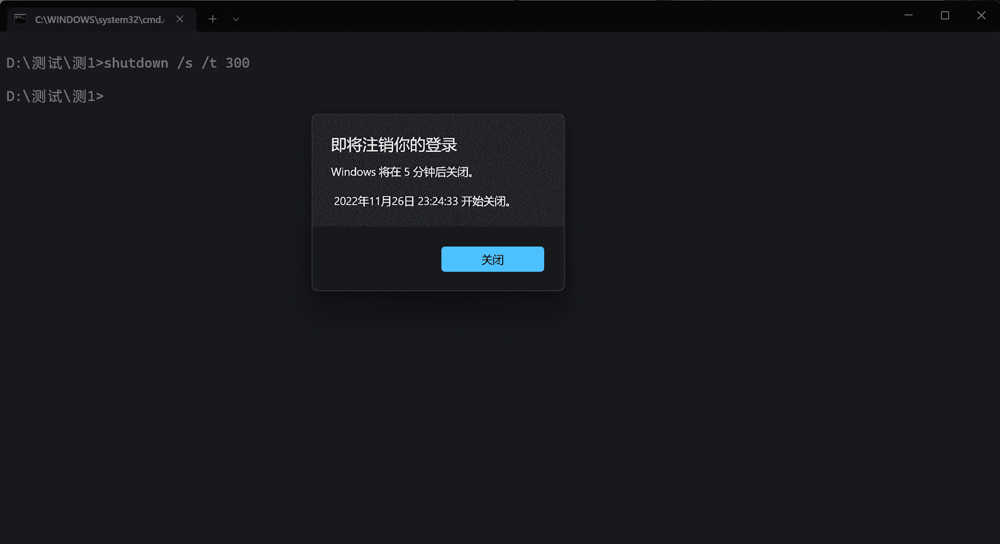
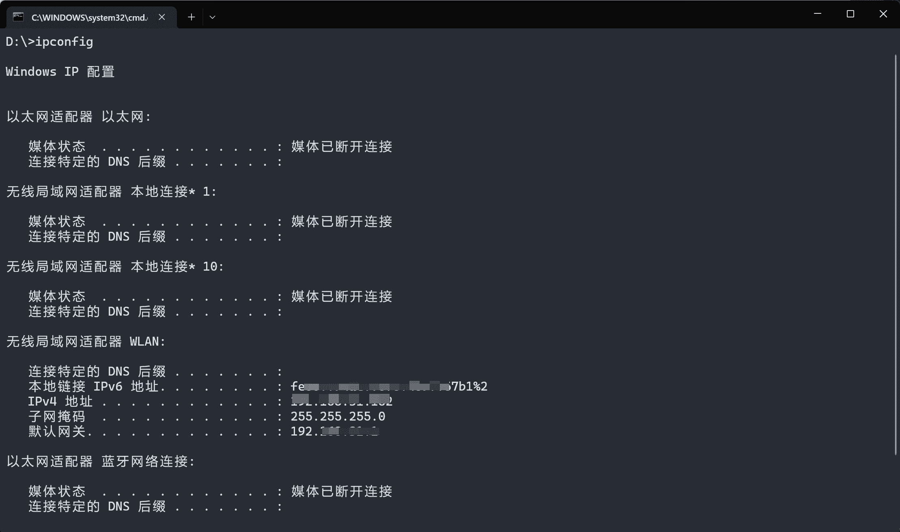
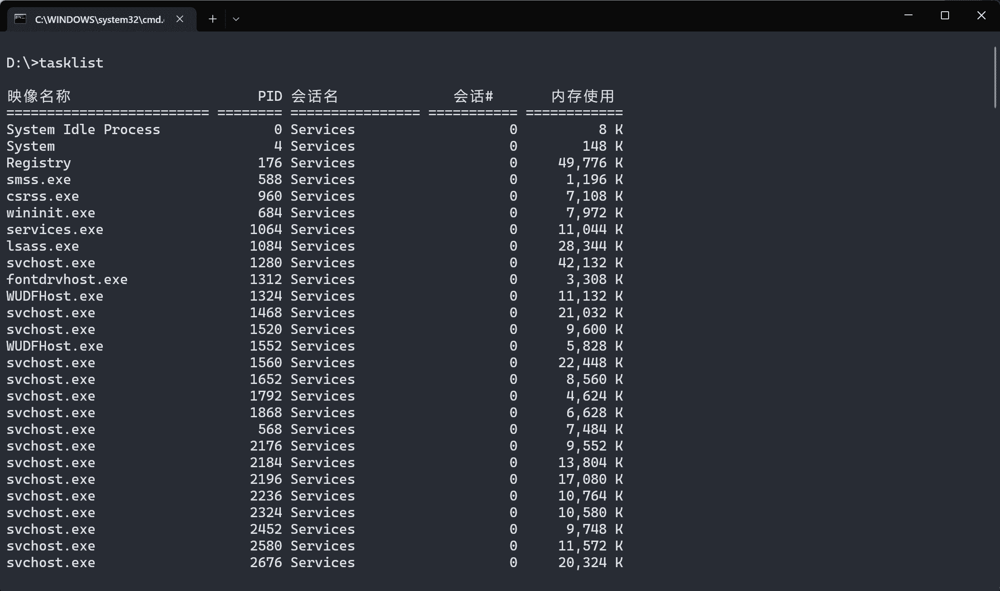
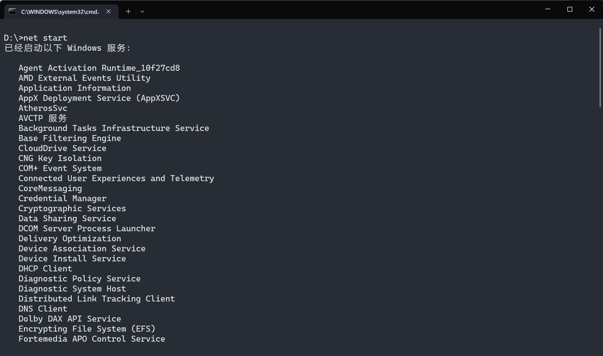

作者：村雨遥

博客：[JavaPark](https://cunyu1943.github.io/JavaPark)

原文：https://mp.weixin.qq.com/s/LAZY7sMiwzNwimTpmlh0rw

> 吾生也有涯，而知也无涯。

---

## 前言

作为一个程序员，可能更多的是在 `Linux` 中使用命令来操作。但在日常使用 `Windows` 的过程中，或多或少会使用到命令提示符窗口，也就是 `Windows` 中的 `CMD`。这个时候，掌握一些常用的命令就尤为重要了，一方面方便自己使用，另一方面，也方便给电脑小白露一手 👀。那接下来就来看看，`CMD` 中最常用的一些命令。

## 如何打开命令提示符窗口

打开的方式很多，这里例举常用的 `5` 种。

1.  **方法 1**

`Win + R` 快捷键打开运行，输入 `cmd` 后回车。

2.  **方法 2**

依次打开开始菜单 -> `Windows` 系统（`Windows` 工具） -> 命令提示符。

3.  **方法 3**

打开资源管理器，然后在地址栏输入 `cmd` 后回车。

4.  **方法 4**

鼠标右键点击开始菜单的 `Win` 图标，找到命令提示符（终端）并进入。

5.  **方法 5**

在任务栏中的搜索栏中搜索 `cmd` 并打开。

## 常用命令

### 目录操作

1.  **磁盘切换**

```shell
盘符 + 冒号
```

如 `D:` 就代码进入 `D` 盘。


2.  **进入指定目录**

```shell
cd 目录
```



3.  **返回磁盘根目录**

```shell
cd \
```


4.  **返回上级目录**

```shell
cd ..
```


5.  **新建目录**

```shell
md 目录名
```


6.  **查看当前目录中内容**

```shell
dir
```



7.  **查看指定目录结构**

```shell
tree 目录
```


8.  **删除目录**

```shell
rd 目录名
```


9.  **复制文件**

```shell
copy 源文件 目标文件
```



10. **删除文件**

```shell
del 文件名
```



### 开关机操作

1.  **关机**

```shell
shutdown /s
```

2.  **重启**

```shell
shutdown /r
```

3.  **注销**

```shell
shutdown /l
```

4.  **休眠**

```shell
shutdown /h /f
```

5.  **定时关机**

```shell
shutdown /s /t 时间（秒）
```



6.  **取消关机**

```shell
shutdown /a
```


### 网络操作

1.  **测试网络延迟和丢包率**

```shell
ping ip/域名
```


2.  **查看本机 ip 地址**

```shell
ipconfig
```



3.  **清除本地 DNS 缓存**

```shell
ipconfig /flushdns
```


4.  **路由追踪**

```shell
tracert ip/域名
```


### 进程/服务操作

1.  **查看当前运行的进程**

```shell
tasklist
```



2.  **运行指定程序或命令**

```shell
start 程序名
```

3.  **按名称结束进程**

```shell
taskkill /im 进程名
```


4.  **按 PID 结束进程**

```shell
taskkill /pid PID
```


5.  **查看当前运行的服务**

```shell
net start
```



6.  **启动指定服务**

```shell
net start 服务名
```


7.  **停止指定服务**

```shell
net stop 服务名
```


### 其他操作

1.  **清除屏幕**

```shell
cls
```


2.  **退出**

```shell
exit
```

## 总结

以上就是今天所带来的 `Windows` 中常用的 `CMD` 命令了，对付日常使用完全够了，更多的一些命令用到的频率较低，可以在有需要的时候再去具体搜索。

如果觉得对各位朋友有用的话，不妨点个赞再走呀 ~